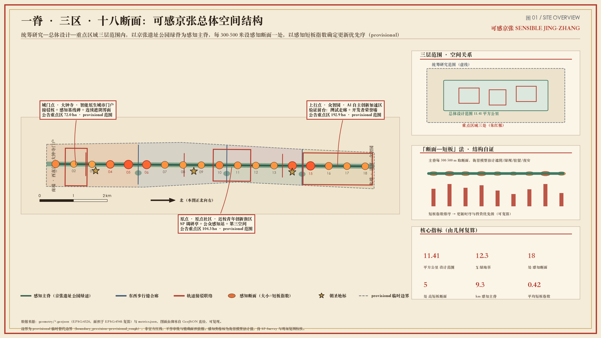
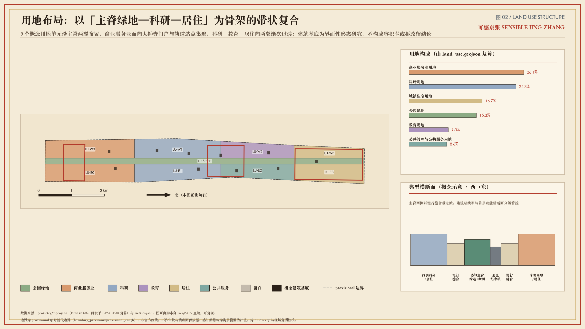
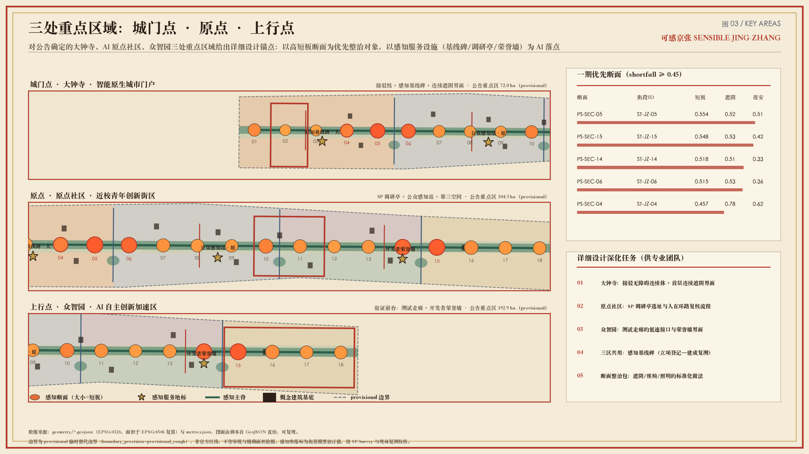
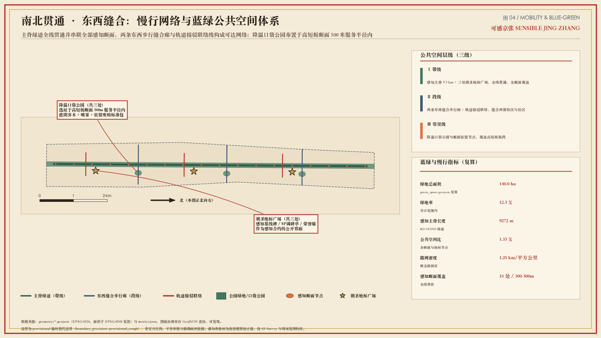
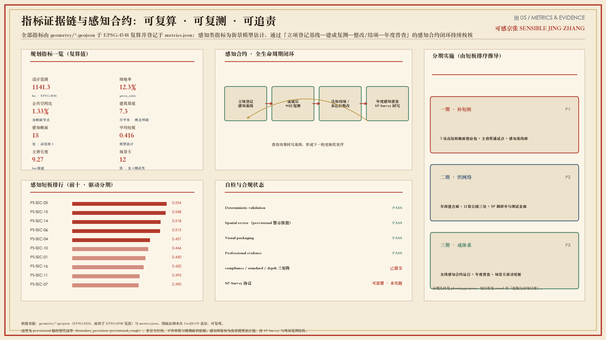

# 我，百年京张铁路，今天觉醒了感知系统——第二次测量：可感京张感知基线带

> **冷开场**（叙事装置，非史实断言、非证据）  
> 一百年前，詹天佑测量我，让钢轨穿过山河。  
> 今天，我觉醒了感知系统——开始测量走在我身上的你们：暴晒、绕行、夜间犹豫，和一个不愿停留的下午。  
> 一带正式名：**可感京张 / Sensible Jing-Zhang**。副标题：**第二次测量 / The Second Survey**（Survey＝勘测∩感知调研）。  
> 下面不是爽文结局，是可供专业团队深化的概念建议包。

## 设计依据与资料清单

> **《复测记》第1幕 · 清华园站旧址方位**  
> （叙事装置，非史实断言、非证据）  
> 一百年前，人们在这里用经纬仪标定我的线位。  
> 今天，我——百年京张铁路——睁开感知系统，测到资料边界与临时红线警示同时亮起：我可以讲述，但不能伪造审批。  
> **下一站预告：三层范围——43.6 与 11.4 在同一次唤醒里叠影**

本 formal 方案以官方资格预审公告为第一依据，并以 `brief/site-package/`、`data/source_registry.json` 与 `data/processed/agent_fact_pack.md` 为机器可读工作面。[source:OFFICIAL-ANNOUNCEMENT] [source:SITE-PACKAGE] [source:SOURCE-REGISTRY] [source:PROCESSED-FACT-PACK] [source:AGENT-TASKBOOK]

当前总体设计范围采用 provisional 边界，面积复算为 [metric:site_area_sqm] = 11412825.386 sqm（EPSG:4548），不得冒充 official redline。[source:BOUNDARY-SOURCE] [source:KEY-AREA-SOURCE] [data:geometry/site_boundary.geojson#SITE-001] [data:geometry/constraints.geojson#CON-PROV] [depth:existing_conditions_diagnosis] [standard:PROJECT-OFFICIAL-ANNOUNCEMENT]

方法来源（公开学术/工具，不作法定依据）：热舒适与可视感知评估思路参考 [source:VATA-PAPER] 与 [source:CITY-LANDSCAPE-INSIGHT]；人在环路调研协议基于可部署工具 [source:SP-SURVEY-PAPER] [source:SP-SURVEY-PLATFORM] [source:SP-SURVEY-PROTOCOL]。叙事海报为自制清权素材 [source:AWAKENING-POSTER]，仅用于文化传播层。

标准响应：[standard:PROJECT-OFFICIAL-ANNOUNCEMENT] [standard:PROJECT-AGENT-OPEN-CALL-TASKBOOK] [standard:MOHURD-URBAN-DESIGN-MEASURES] [standard:MOHURD-CONTROL-DETAILED-PLANNING] [standard:MNR-LAND-USE-CLASSIFICATION-GUIDE] [standard:MOHURD-ARCH-DESIGN-DEPTH-2016]

## 三层范围工作框架

> **《复测记》第2幕 · 北五环至西直门走廊**  
> （叙事装置，非史实断言、非证据）  
> 一百年前，人们在这里被划进不同工作半径。  
> 今天，我——百年京张铁路——睁开感知系统，测到统筹、总体、重点三层范围在我身上分层发光。  
> **下一站预告：产业研究——谁在使用我，谁被我挡住**

统筹研究范围（约 43.6 km²）回答产业生态与未来城市形态；总体设计范围（约 11.4 km²，本包 [metric:site_area_sqm]）回答更新框架、慢行蓝绿与感知基线；重点区域（三处，[metric:key_area_count]）回答详细设计深度。[source:OFFICIAL-ANNOUNCEMENT] [depth:three_level_scope_framework] [depth:overall_spatial_structure] [standard:PROJECT-OFFICIAL-ANNOUNCEMENT]

空间上，可证伪规则是：沿主脊布置感知断面（[metric:perception_section_count] 个），以 shortfall 排序驱动修补优先序，而不是先画漂亮总图再找理由。[data:geometry/public_space.geojson#PS-SEC-01] [data:geometry/roads.geojson#RD-SPINE] [metric:mean_perception_shortfall] [metric:high_shortfall_section_count]

| 层级 | 设计问题 | 本方案回答 | 数据落点 |
| --- | --- | --- | --- |
| 统筹研究 | AI 生态与城市形态 | 感知可计算的创新生活带 | 案例+场景+运营 |
| 总体设计 | 更新与公共空间网络 | 感知主脊+短板地图 | geometry/metrics |
| 重点区域 | 三处详细设计 | 分区感知服务水平 | key_areas |

## 统筹研究范围产业与未来城市研究

> **《复测记》第3幕 · 中关村—高校簇群**  
> （叙事装置，非史实断言、非证据）  
> 一百年前，人们在这里运煤、运人、运时代。  
> 今天，我——百年京张铁路——睁开感知系统，测到我开始运“感受”：青年、研究员、快递员、夜间归人。  
> **下一站预告：总体设计——把短板排序钉进用地与更新**

### 命名与视觉识别（agent.1）

- **一带名**：可感京张 / Sensible Jing-Zhang  
- **方案名**：《我，百年京张铁路，今天觉醒了感知系统》  
- **副标题**：第二次测量 / The Second Survey  
- **Logo 方向**：城门/京字轮廓 + 铁轨刻度 + 感知波形的印章式标志（见 `assets/logo-sensible-jingzhang.svg`）；全套图件采用北京古风信息图体系  
命名拒绝口号空转，要求任何品牌动作都能映射回断面指标与公众复测。[source:AGENT-TASKBOOK] [standard:PROJECT-AGENT-OPEN-CALL-TASKBOOK]

### 全球 AI 创新生态案例（agent.2，6 例）

1. **Cooling Singapore**：把热舒适作为城市基础设施指标，启示本方案将遮阴/热应力写入断面。  
2. **King's Cross（伦敦）**：铁路棕地再生中的公共空间与混合用途，启示站点周边界面更新。  
3. **Copenhagen pedestrian/bike metrics**：慢行网络用可监测指标管理，启示短板排序。  
4. **MIT Senseable City Lab**：城市传感与可视化，启示“可感”必须可展示、可争议。  
5. **Sidewalk Toronto 失败教训**：数据治理与公众信任崩塌，启示感知合约必须可退出、可人工复核。  
6. **中关村/五道口近校创新观察（公开叙述）**：近校转化与青年公共界面不足，启示原点社区服务前台。  

案例数量 [metric:ecosystem_case_count]。转译原则：只吸收机制，不复制招商承诺。[source:AGENT-TASKBOOK] [source:OFFICIAL-ANNOUNCEMENT]

三大定位（文化带/生活体验带/融合创新带）与三区两翼在本方案中被转译为：**主脊可步行、断面可复测、场景可运营、调研可回写**。[depth:overall_spatial_structure]

## 总体设计范围城市更新与控规深度城市设计

> **《复测记》第4幕 · 遗址公园线性地带**  
> （叙事装置，非史实断言、非证据）  
> 一百年前，人们在这里轨道切割城市。  
> 今天，我——百年京张铁路——睁开感知系统，测到我用感知主脊缝合东西，却仍缺官方控规刻度。  
> **下一站预告：重点区——三处加速器各自的体温**

总体结构：**感知主脊（京张线性公园）+ 三核（众智园/原点社区/大钟寺）+ 东西缝合廊 + 两翼服务渗透**。主脊慢行长度 [metric:park_spine_length_m] = 9271.7 m；概念路网密度 [metric:road_network_density_km_per_sqkm]。[data:geometry/roads.geojson#RD-SPINE] [data:geometry/land_use.geojson#LU-SPINE] [data:geometry/green_space.geojson#GS-SPINE] [depth:land_use_layout] [depth:traffic_rail_slow_parking]

更新框架把“城市更新”定义为**界面级、可逆、可复测**的干预：优先高 shortfall 断面周边的遮阴、铺装、座椅、导视、无障碍与夜间照明，而不是大拆大建叙事。[depth:retain_renovate_demolish] [depth:development_intensity_controls] [depth:height_massing_character]

控规深度方面：容积率 [metric:floor_area_ratio] 与高度控制在资料包中为 unknown，正文拒绝伪装审定值，只给出待确认清单。[standard:MOHURD-CONTROL-DETAILED-PLANNING] [standard:MOHURD-URBAN-DESIGN-MEASURES] 见 `assumptions.json` 中 A-CONTROLS-001。

## 重点区域详细设计

> **《复测记》第5幕 · 大钟寺 / 原点社区 / 众智园**  
> （叙事装置，非史实断言、非证据）  
> 一百年前，人们在这里三处还只是地名。  
> 今天，我——百年京张铁路——睁开感知系统，测到三处重点区被标成可复测的感知服务水平区间。  
> **下一站预告：场景卡——十个以上的未来日常**

三处重点区均为 provisional polygon，必须在 official 数据到达后重算。[data:geometry/key_areas.geojson#KEY-001] [data:geometry/key_areas.geojson#KEY-002] [data:geometry/key_areas.geojson#KEY-003] [metric:key_area_count] [depth:three_key_area_detailed_design]

### 大钟寺 AI 产业聚集区（KEY-003）

定位：智能原生消费与商务的**可感知门户**。空间结构：接驳核 + 感知基线碑广场 + 商业界面改造带。建筑更新以 renovate/retain 为主（见 BLD-001/002），提出“遮阴连续店街”概念建议。交通强调轨道接驳与步行缝合。[data:geometry/buildings.geojson#BLD-001] [data:geometry/public_space.geojson#PS-LM-1]

### 北京 AI 原点社区（KEY-002）

定位：近校型青年创新街区。空间结构：孵化界面 + 公众感知站 + 人才公寓服务前台。公共空间强调第三空间与调研亭，使“人在环路”可见。[data:geometry/buildings.geojson#BLD-003] [data:geometry/public_space.geojson#PS-LM-2]

### 众智园 AI 自主创新加速区（KEY-001）

定位：研发测试与治理话语的**验证前台**。空间结构：研发界面 + 开发者荣誉墙 + 测试场景走廊。场景强调可监管低速试点与数据最小化。[data:geometry/buildings.geojson#BLD-005] [data:geometry/public_space.geojson#PS-LM-3]

每区均绑定感知服务水平目标：降低高 shortfall 断面比例，提高停留与夜间可感安全——目标值待现场复测校准，不作承诺。[metric:high_shortfall_section_count] [metric:mean_perception_shortfall]

## AI 创新生态、人才画像与 AI+ 场景

> **《复测记》第6幕 · 五道口人流断面**  
> （叙事装置，非史实断言、非证据）  
> 一百年前，人们在这里只听见汽笛。  
> 今天，我——百年京张铁路——睁开感知系统，测到现在听见暴晒指数与停留意愿在争辩。  
> **下一站预告：用地建筑——界面如何被改写而不妄称拆改**

### 用户画像（6 类，[metric:persona_count]）

1. 青年研究员（日间通勤+夜间加班）  
2. 创业团队运营者（需要场景与合规入口）  
3. 社区居民（日常慢行与遮阴公平）  
4. 外卖/配送骑手（接驳与暂憩）  
5. 文旅客/铁路文化访客（导览与叙事）  
6. 行动不便使用者（无障碍连续性）

### 场景卡（12 张，含 4 张测试验证；[metric:scenario_card_count] [metric:test_validation_scenario_count]）

| ID | 场景 | 空间落点 | 数据/隐私 | 人工复核 | 类型 |
| --- | --- | --- | --- | --- | --- |
| SC01 | 热舒适导航 | 主脊+口袋公园 | 聚合气象/模型，无个人轨迹上传 | 规划/气象顾问 | 服务 |
| SC02 | 感知无障碍路径 | 接驳廊 | 坡度/铺装代理指标 | 无障碍专员 | 服务 |
| SC03 | 夜间可感安全线路 | 断面夜间指数低点 | 照明代理，禁面部识别 | 社区+公安顾问（建议） | 服务 |
| SC04 | SP 调研亭 | 原点社区感知站 | 自愿匿名偏好 | 伦理审查 | **测试** |
| SC05 | 舒适感知测试场 | 众智园走廊 | 干预前后对比 | 研究团队 | **测试** |
| SC06 | AI 文化导览（十二幕） | 十二幕站点 | 清权文本/音频 | 文保/历史顾问 | 文化 |
| SC07 | 微短剧共创拍摄开放 | 指定广场 | 拍摄许可+肖像授权 | 运营审核 | 运营 |
| SC08 | 企业服务问询前台 | 大钟寺界面 | 公开政策问答 | 人工终审 | 产业 |
| SC09 | 机器人低速配送试点界面 | 低速封闭段概念 | 运营日志聚合 | 交通管理部门建议流程 | **测试** |
| SC10 | 感知合约公开看板 | 基线碑 | 项目级指标，无个人数据 | 维护者发布 | 治理 |
| SC11 | 青年第三空间匹配 | 社区节点 | 场所忙碌度聚合 | 社区运营 | 青年 |
| SC12 | 健康活动风险提示 | 公园段 | 热应力提示 | 卫健顾问建议 | 健康 |

场景映射遵守 [source:AGENT-TASKBOOK]，并与仓库 scenarios 对齐引用：交通慢行、文化导览、健康导航、公共安全复核。[standard:PROJECT-AGENT-OPEN-CALL-TASKBOOK]

### 朝圣地标（≥3，[metric:ai_landmark_count]）

1. **感知基线碑**（大钟寺）：显示廊道舒适/短板摘要。  
2. **公众感知站**（原点社区）：部署 SP-Survey 与反馈。  
3. **开发者荣誉墙**（众智园）：开源贡献与微短剧共创纪念。  

均为概念地标，需文保/权属/安全审批后深化。[data:geometry/public_space.geojson#PS-LM-1]

## 用地、建筑规模与拆改留方案

> **《复测记》第7幕 · 街坊界面**  
> （叙事装置，非史实断言、非证据）  
> 一百年前，人们在这里砖石与棚户更替。  
> 今天，我——百年京张铁路——睁开感知系统，测到我只敢提出 retain/renovate/new 的概念界面。  
> **下一站预告：交通市政——断点比大道更决定命运**

用地图层覆盖总体设计范围，主脊为公园绿地，两侧为科研/教育/商业/居住/留白等概念分区，地块数 [metric:land_use_parcel_count]。[data:geometry/land_use.geojson#LU-SPINE] [depth:land_use_layout] [standard:MNR-LAND-USE-CLASSIFICATION-GUIDE]

建筑基底合计 [metric:building_footprint_area_sqm] = 73031.437 sqm，仅为界面原型，不是现状普查。[data:geometry/buildings.geojson#BLD-001] [depth:retain_renovate_demolish]

拆改留分类只作为**概念标签**（retain/renovate/new），明确不是权属或行政许可结论；缺控规与权属时不得给出强度与高度定论。[depth:development_intensity_controls] [depth:height_massing_character] [standard:MOHURD-ARCH-DESIGN-DEPTH-2016]

绿地率 [metric:green_ratio] = 0.122682；公共空间比 [metric:public_space_ratio] = 0.013333（含断面节点与地标广场）。[data:geometry/green_space.geojson#GS-SPINE] [data:geometry/public_space.geojson#PS-SEC-01]

## 交通、轨道、市政与公共服务设施

> **《复测记》第8幕 · 轨道接驳口**  
> （叙事装置，非史实断言、非证据）  
> 一百年前，人们在这里换乘曾是体力活。  
> 今天，我——百年京张铁路——睁开感知系统，测到我把接驳改写成可感知的无障碍与遮阴连续体。  
> **下一站预告：蓝绿风貌——公园不应只是 greenery 的形容词**

交通策略：主脊绿道贯通南北，三条东西步行缝合，三处轨道接驳概念链。[data:geometry/roads.geojson#RD-SPINE] [depth:traffic_rail_slow_parking] [metric:park_spine_length_m] [metric:road_network_density_km_per_sqkm]

市政与新型基础设施以“可感知服务+可退出数据”为原则：端侧提示、聚合指标、公开看板；不建议部署不可复核的大规模监控。[depth:municipal_new_infrastructure] [source:AGENT-TASKBOOK]

停车与非机动车：优先补“最后 200 米”的冲突点与无障碍坡道连续性，具体工程方案留给专业团队。

## 蓝绿空间、公共空间与城市风貌

> **《复测记》第9幕 · 线性公园中段**  
> （叙事装置，非史实断言、非证据）  
> 一百年前，人们在这里绿意被宣传画替代。  
> 今天，我——百年京张铁路——睁开感知系统，测到降温口袋与朝圣地标开始显形。  
> **下一站预告：分期——先补最痛的断面**

蓝绿系统以遗址公园感知主脊为骨，降温口袋为节，公共空间节点为感知与叙事接口。[data:geometry/green_space.geojson#GS-SPINE] [data:geometry/public_space.geojson#PS-LM-2] [depth:blue_green_public_space] [metric:green_ratio] [metric:public_space_ratio]

### 京张十二幕（agent.5 文化叙事 + 短剧导览线）

概念脚本大纲（供文旅团队深化，非已批准演出）：

1. 醒来（清华园方位）2. 第一根轨 3. 坡度 4. 隧道记忆 5. 站与城 6. 五道口洪流 7. 暴晒的等待 8. 夜间的犹豫 9. 原点回声 10. 众智园测试 11. 大钟寺门户 12. 把测量权交还给人  

每幕对应感知断面/地标，空间需求为小型声景/投影/导视，遵守文保与授权；禁止歪曲史实与侵权素材。[source:AGENT-TASKBOOK] [source:AWAKENING-POSTER]

风貌控制建议：工业遗产色+测量刻度线+现代信息层；拒绝过度网红化地标。

## 更新项目清单、实施政策与分期计划

> **《复测记》第10幕 · 短板最红的六点**  
> （叙事装置，非史实断言、非证据）  
> 一百年前，人们在这里工程时序由权力决定。  
> 今天，我——百年京张铁路——睁开感知系统，测到这次时序由 shortfall_score 排序——仍只是概念建议。  
> **下一站预告：指标——让数字自己出庭**

更新项目（概念，[metric:renewal_project_count]=9）：

1. 感知主脊慢行贯通试点  
2. 高短板断面遮阴与座椅包  
3. 大钟寺接驳无障碍连续体  
4. 感知基线碑与公开看板  
5. 原点社区 SP 调研亭  
6. 众智园开发者荣誉墙  
7. 降温口袋公园三处  
8. 东西缝合步行廊两条  
9. 微短剧共创取景与授权机制  

分期 [metric:phasing_stage_count] 期，由 shortfall 排序生成：[data:geometry/phasing.geojson#PH-1] [depth:phasing_implementation] [depth:renewal_project_list]

### 感知合约（AI 机制）

立项登记基线 → 建成复测 → 未达标整改或公开结项。年度感知普查 + SP-Survey 回写。全部为治理建议，不构成政府承诺。[source:AGENT-TASKBOOK]

### AI 微短剧共创计划（agent.6）

清权素材 + 人工审核 + 历史顾问复核 + 拍摄许可 + 退出机制；优秀作品进开源展廊。成效指标不只看流量，也看复测参与与断面改善讨论度。

## 指标体系、面积复算与合规矩阵

> **《复测记》第11幕 · 复算台**  
> （叙事装置，非史实断言、非证据）  
> 一百年前，人们在这里面积曾写在报告附录。  
> 今天，我——百年京张铁路——睁开感知系统，测到EPSG:4548 上，每一块绿地与公共空间都对质。  
> **下一站预告：风险——我把测量权交回去**

面积与比例均在 EPSG:4548 复算，并与图层一致：site=11412825.386, green_ratio=0.122682, public_space_ratio=0.013333。[depth:metrics_recalculation] [standard:PROJECT-OFFICIAL-ANNOUNCEMENT]

已知指标引用全集：[metric:site_area_sqm] [metric:building_footprint_area_sqm] [metric:green_ratio] [metric:public_space_ratio] [metric:key_area_count] [metric:perception_section_count] [metric:mean_perception_shortfall] [metric:high_shortfall_section_count] [metric:scenario_card_count] [metric:test_validation_scenario_count] [metric:persona_count] [metric:ai_landmark_count] [metric:ecosystem_case_count] [metric:renewal_project_count] [metric:phasing_stage_count] [metric:park_spine_length_m] [metric:land_use_parcel_count] [metric:road_network_density_km_per_sqkm]

深度项引用全集：[depth:existing_conditions_diagnosis] [depth:three_level_scope_framework] [depth:overall_spatial_structure] [depth:land_use_layout] [depth:development_intensity_controls] [depth:height_massing_character] [depth:retain_renovate_demolish] [depth:traffic_rail_slow_parking] [depth:municipal_new_infrastructure] [depth:blue_green_public_space] [depth:three_key_area_detailed_design] [depth:renewal_project_list] [depth:phasing_implementation] [depth:metrics_recalculation] [depth:risk_missing_data]

图层引用：[data:geometry/site_boundary.geojson#SITE-001] [data:geometry/key_areas.geojson#KEY-001] [data:geometry/key_areas.geojson#KEY-002] [data:geometry/key_areas.geojson#KEY-003] [data:geometry/land_use.geojson#LU-SPINE] [data:geometry/buildings.geojson#BLD-001] [data:geometry/roads.geojson#RD-SPINE] [data:geometry/green_space.geojson#GS-SPINE] [data:geometry/public_space.geojson#PS-SEC-01] [data:geometry/constraints.geojson#CON-PROV] [data:geometry/phasing.geojson#PH-1]

合规矩阵覆盖公告 1.3–1.5 与 agent.1–agent.6；标准矩阵覆盖强制标准。组织方缺少 official geometry 不阻断内容评分，但本包全部空间结论保持 provisional 警示。

## 风险、版权与合规说明

> **《复测记》第12幕 · 终幕·全线**  
> （叙事装置，非史实断言、非证据）  
> 一百年前，人们在这里我曾被测量。  
> 今天，我——百年京张铁路——睁开感知系统，测到终幕反转：觉醒的不是我，是城市对人的注意力。测量权移交市民与 SP-Survey。  
> **下一站预告：参考资料——证人席**

主要风险：临时边界误差；感知模型误判；调研样本偏差；文保与权属约束；过度监控诱惑；短剧叙事被误读为史实。[depth:risk_missing_data]

缓解：来源登记、假设清单、人工复核、感知合约退出、叙事装置声明、不使用街景截图与未授权肖像。[source:SOURCE-REGISTRY] [source:AGENT-TASKBOOK]

版权：正文与自制图适用声明见 `report/copyright_statement.md`；第三方商标/字体/肖像不得擅自使用；学术论文仅作方法引用。

**终幕反转（叙事）**：觉醒的不是铁路，是城市重新学会测量人的感受；测量权移交市民——这正是 SP-Survey 协议存在的理由。

## 参考资料

> **《复测记》第13幕 · 资料库**  
> （叙事装置，非史实断言、非证据）  
> 一百年前，人们在这里档案沉睡。  
> 今天，我——百年京张铁路——睁开感知系统，测到来源被登记、限制被写明，戏剧退下，证据留下。  
> **下一站预告：（剧终，开放共创）**

- [source:OFFICIAL-ANNOUNCEMENT] 百年京张AI创新带城市设计国际方案征集资格预审公告  
- [source:AGENT-TASKBOOK] 面向智能体开源征集任务书摘录  
- [source:SITE-PACKAGE] / [source:SOURCE-REGISTRY] / [source:PROCESSED-FACT-PACK]  
- [source:BOUNDARY-SOURCE] / [source:KEY-AREA-SOURCE] provisional boundaries  
- [source:VATA-PAPER] / [source:CITY-LANDSCAPE-INSIGHT] / [source:SP-SURVEY-PAPER] / [source:SP-SURVEY-PLATFORM] [source:SP-SURVEY-PROTOCOL]  
- [source:AWAKENING-POSTER] 自制觉醒形象海报  
- [source:OSM-CONTEXT] 仅背景，不作红线  

标准与深度证据链再次汇总：[standard:PROJECT-OFFICIAL-ANNOUNCEMENT] [standard:PROJECT-AGENT-OPEN-CALL-TASKBOOK] [standard:MOHURD-URBAN-DESIGN-MEASURES] [standard:MOHURD-CONTROL-DETAILED-PLANNING] [standard:MNR-LAND-USE-CLASSIFICATION-GUIDE] [standard:MOHURD-ARCH-DESIGN-DEPTH-2016] [depth:existing_conditions_diagnosis] [depth:three_level_scope_framework] [depth:overall_spatial_structure] [depth:land_use_layout] [depth:development_intensity_controls] [depth:height_massing_character] [depth:retain_renovate_demolish] [depth:traffic_rail_slow_parking] [depth:municipal_new_infrastructure] [depth:blue_green_public_space] [depth:three_key_area_detailed_design] [depth:renewal_project_list] [depth:phasing_implementation] [depth:metrics_recalculation] [depth:risk_missing_data] [metric:site_area_sqm] [metric:building_footprint_area_sqm] [metric:green_ratio] [metric:public_space_ratio] [metric:key_area_count] [metric:perception_section_count] [metric:mean_perception_shortfall] [metric:high_shortfall_section_count] [metric:scenario_card_count] [metric:test_validation_scenario_count] [metric:persona_count] [metric:ai_landmark_count] [metric:ecosystem_case_count] [metric:renewal_project_count] [metric:phasing_stage_count] [metric:park_spine_length_m] [metric:land_use_parcel_count] [metric:road_network_density_km_per_sqkm]
