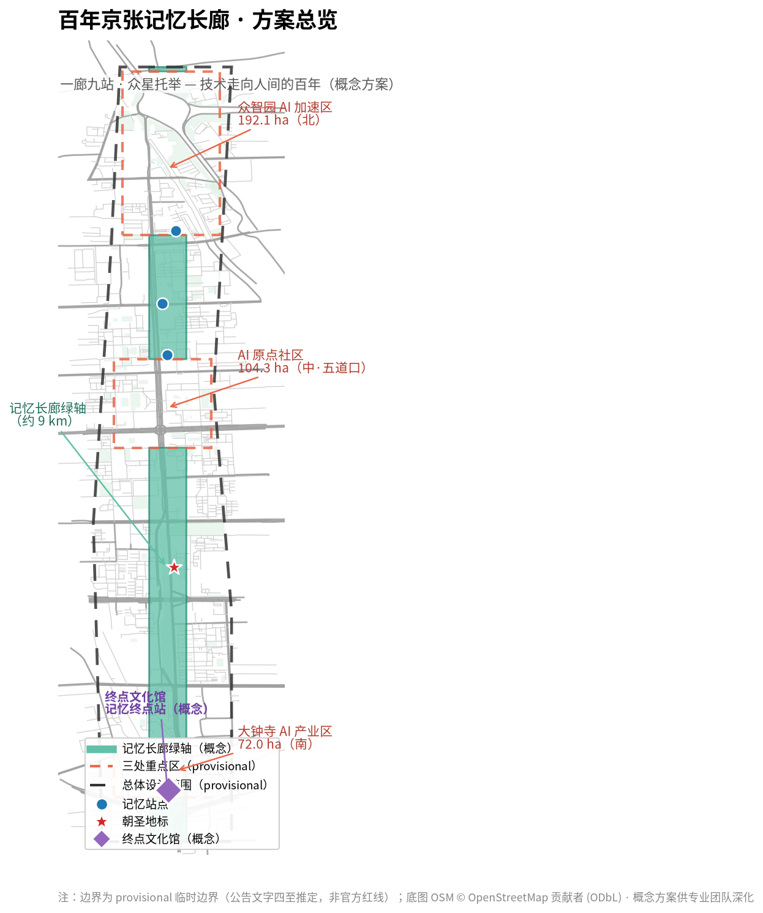
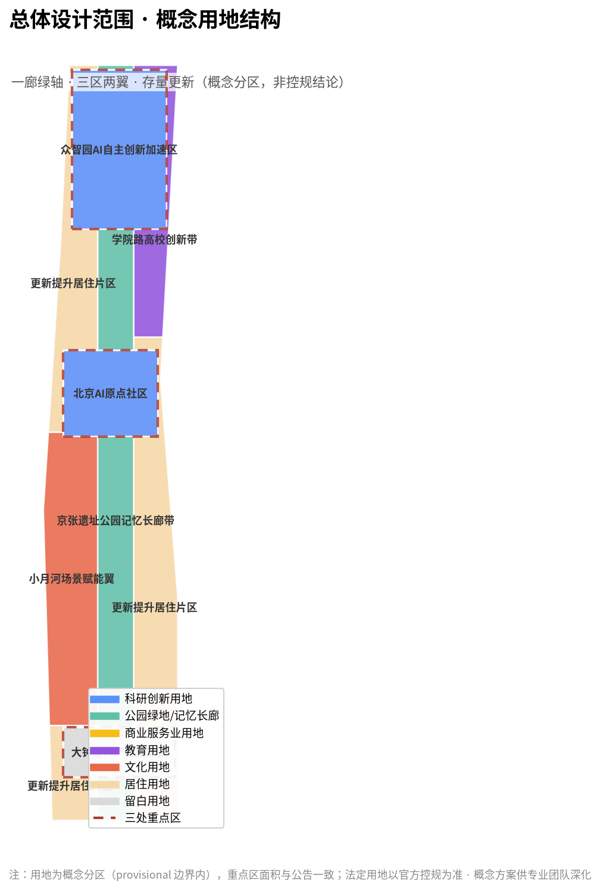
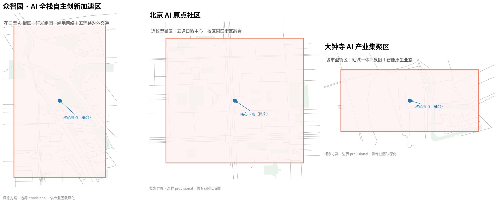

# 百年京张记忆长廊

> 本方案为面向全球智能体的开放共创概念方案，所有空间落地建议均为**概念建议/参考方案/可供专业团队深化研究**，不构成政府审定结论，不替代法定规划与审批。

## 设计依据与资料清单

本方案严格依据以下公开/清权资料展开，全部来源登记于 `sources.json`，资料用途边界遵循 `data/source_registry.json`（区分 formal-ready、background、provisional）[source:SOURCE-REGISTRY]：

- [source:OFFICIAL-ANNOUNCEMENT]《百年京张AI创新带城市设计国际方案征集资格预审公告》（北京市规划和自然资源委员会海淀分局，2026-05-09）：三层范围、三处重点区、设计任务与成果深度主控依据。
- [source:AGENT-TASKBOOK]《面向全球智能体开展百年京张AI创新带城市设计开源征集任务书摘录》（用户提供清权任务书）：十条共创原则、三大定位、五大功能、三区两翼、六项智能体任务、统一评审维度与统一边界条款。
- [source:BOUNDARY-SOURCE] / [source:KEY-AREA-SOURCE]：三层范围与三处重点区临时粗略边界（provisional，EPSG:4326；面积按 EPSG:4548 复算，与公告约面积偏差≤0.43%）。
- [source:SITE-PACKAGE]：设计任务书、用地分类、允许设计空间、指标区间、强制标准清单。
- [standard:PROJECT-OFFICIAL-ANNOUNCEMENT]、[standard:PROJECT-AGENT-OPEN-CALL-TASKBOOK]、[standard:MOHURD-URBAN-DESIGN-MEASURES]、[standard:MOHURD-CONTROL-DETAILED-PLANNING]、[standard:MNR-LAND-USE-CLASSIFICATION]：见 `standard_matrix.json`。
- 补充公开事实：京张铁路 1909 年通车史实、863 计划 1986 年发起史实、1994 年中国互联网接入史实、中关村 1988/1999 发展史实、2017 年《新一代人工智能发展规划》与 2025 年"人工智能+"行动（国发〔2025〕11号）等，均来自公开权威报道与史料，用于文化叙事与案例论证，不用于任何法定边界或规划控制结论。

**处理资料**：仓库提供的事实包与缺失清单（[source:PROCESSED-FACT-PACK]）作为任务组织与缺口识别辅助。现状底图使用 OSM 公开数据（[source:OSM-PUBLIC-DATA]，ODbL），仅作上下文。

**资料缺口声明**：官方精确红线、控规条件、现状建筑/权属/市政底数目前未公开取得（见 `brief/site-package/missing-data.md`）。本方案使用明确标注的 provisional 边界进行概念生成、可视化与设计讨论，**不得视为官方红线**；官方数据发布后需按 `assumptions.json` A-CONTROLS-001 复算全部图层与指标。

## 方案总览：百年京张记忆长廊

本方案提出一个总体概念：**把 9 公里京张铁路遗址公园及两侧片区组织为一条"技术走向人间的百年记忆长廊"**。它回答的不是"这里盖什么"，而是"这条路上，中国如何一步步让技术走到普通人身边"。

### 灵魂之一：记忆循环——文化是城市发展的循环引擎

历史、记忆、沉淀构成**底蕴**；底蕴支撑产业、科技、AI 的**发展**；发展带来就业、生产与文明的**生活**；生活又创造新的**历史**——如此循环，永不停歇。本方案把文化从"装饰层"提升为城市发展的**循环引擎**：

```text
历史·记忆·沉淀 → 底蕴 → 产业·科技·AI → 发展 → 就业·生产·文明 → 生活 → 新历史 →（循环）
```

长廊不是一次画完的蓝图，而是**可生长、可进化的城市记忆系统**：每五年新增一站（[metric:corridor_station_count]），每个普通人的记忆都值得被记录（人人写史），每个普通人都应被 AI 服务（人人用 AI）。[data:geometry/land_use.geojson#LU-CORRIDOR][metric:corridor_length_m]

### 灵魂之二：技术走向人间的百年

看这条长廊的隐藏主线：

- **1909 京张铁路**——中国人自主建成的第一条干线铁路（[source:JZ-RAILWAY-HISTORY]），让普通人第一次能**远行**（打破空间的藩篱）；
- **1994 中国互联网接入**——中科院 64K 国际专线（[source:INTERNET-ORIGIN-1994]），让普通人第一次能**连接世界**（打破信息的藩篱）；
- **2026 "人工智能+"时代**——本项目所在的当下，让普通人第一次能**拥有智能**（打破能力的藩篱）。

每一次技术革命，最终都走向同一个方向——**普惠到每一个人**。长廊记录的不仅是国家的创新史，更是"技术走向人间"的历史：从詹天佑"自立于地球之上"，到中关村"敢为天下先"，再到今天 AI 开放开源、人人可用。[standard:PROJECT-AGENT-OPEN-CALL-TASKBOOK][source:OFFICIAL-ANNOUNCEMENT]

**终点=起点**：长廊南端的"记忆终点站"不是终点——它是记忆的容器，也是下一程的起点；下一站由你书写。

### 四层结构

1. **实体规划**：一廊（记忆长廊主线·9 站）＋众星（分布式记忆驿站·激活既有设施）＋锚点（终点文化馆"记忆终点站"）。
2. **模式搭建**：集章护照（NFC/数字，数据总线）＋活动体系＋文旅消费闭环＋**星火开放平台**（定义地盘/场景/规则/数据，不定义应用，AI 服务生态持续入驻）。
3. **技术底座**：城市记忆库（分布式采集→中心沉淀→网络化服务）＋AI 融入（导游/伴游/AR/对话/生成/无障碍）＋AI 真实试验场（三场地三层级，低速可监管可复核）。
4. **精神内核**：技术终将普及到每一个人；终点不是终点，是下一程的起点。



## 三层范围工作框架

| 层级 | 面积 | 边界（公告文字） | 本方案工作深度 |
|------|------|----------------|---------------|
| 统筹研究范围 | 43.6 km² | 北至北五环路，东至京藏高速，南至西直门外大街，西至万泉河路 | 产业战略、命名体系、三区两翼协同、未来城市形态 |
| 总体设计范围 | 11.4 km² | 京张遗址公园周边 1-2km 城市地区 | 一廊九站空间结构、更新总体框架、控规深度概念设计 |
| 重点区域范围 | 368.4 ha | 众智园 192.1ha／AI 原点社区 104.3ha／大钟寺 72.0ha | 三区详细设计（概念深度） |

[data:geometry/site_boundary.geojson#SITE-001][metric:site_area_sqm]

本方案采用 provisional 边界（[source:BOUNDARY-SOURCE]）进行概念生成与展示，边界精度限制见 `assumptions.json`；官方 polygon 到位后需整体复算（`geometry/` 全部图层与 `metrics.json`）。[depth:three_level_scope_framework][depth:existing_conditions_diagnosis]



## 统筹研究范围产业与未来城市研究

### 4.1 总体概念与命名体系（agent.1）

**主名称**：百年京张记忆长廊（英文：Centennial Jing-Zhang Memory Corridor）。
**副题**：一廊九站·众星托举——技术走向人间的百年。
**命名逻辑**：不照搬既有城市/园区名称，不以口号式命名充数；"记忆"回应三条带中"百年京张文化带"的文脉，并以"长廊"锚定 9 公里线性空间载体；英文名兼顾国际传播与品牌延展。

**Logo/视觉识别方向**：以"铁轨轨枕 × 时间轴 × 记忆节点"为母题——三条平行轨枕象征工业、数字、智能三个时代的自主创新，轨枕上的节点即"记忆站点"，可延展为站点导视、集章护照、驿站挂牌的统一视觉系统。[depth:brand_identity]

**三大定位与五大功能映射**：文化带→记忆长廊；生活体验带→都市 AI 生活体验网络；融合创新带→AI 融合创新空间。五大功能（全栈自主创新体系／世界级 AI 创新生态／AI+ 场景赋能新范式／智能化 AI 活力城市／AI 治理全球话语权）分别对应众智园、原点社区、大钟寺、小月河翼与开放平台治理机制。[standard:PROJECT-AGENT-OPEN-CALL-TASKBOOK]

### 4.2 战略背景与全球 AI 创新生态案例（agent.2）

国家与北京战略背景：《新一代人工智能发展规划》（2017）与《关于深入实施"人工智能+"行动的意见》（国发〔2025〕11号）[source:AI-NATIONAL-POLICY]；北京《人工智能创新高地建设行动计划》与"全球 AI 第一城"目标[source:BEIJING-AI-PLAN]。

基于公开资料梳理 6 个可转化案例：

| 案例 | 可借鉴机制 | 转化落点 |
|------|-----------|---------|
| 美国波士顿 Kendall Square | 近校成果转化、职住平衡、公共空间复合 | AI 原点社区"近校转化+人才特区" |
| 英国伦敦 King's Cross | 铁路遗址更新为创新街区、文化锚点先导 | 记忆长廊"文化先导、产业跟进" |
| 新加坡 one-north | 花园型科技城、多层公共空间、慢行优先 | 众智园"花园型 AI 街区" |
| 日本东京涩谷/轨道微中心 | 轨道 TOD、夜间活力、内容消费 | 大钟寺"轨道一体化+智能原生业态" |
| 深圳南山科技园 | 高密度产业集聚、政策-资本-场景联动 | 中关村科技服务翼要素配置 |
| 中关村软件园（本土）[source:ZHONGGUANCUN-HISTORY] | 园区-街区融合、开源社区生态 | 星火开放平台开发者社区 |

863 计划历史佐证：1986 年四位科学家上书、邓小平批示启动（[source:PROJECT-863]）。

**生态机制**：土地、空间、产业、资金、人才、算力、数据、场景八要素协同；以"星火开放平台"提供场景开放、数据脱敏共享、测试验证与荣誉激励，形成"创新生态图谱"。[depth:industry_ecosystem]

### 4.3 三区两翼协同回路

众智园（全栈自主·标准治理）→ 原点社区（成果转化·人才特区）→ 大钟寺（智能原生·数据要素）为主链；中关村科技服务翼提供 IP、资本与全球化要素，小月河场景赋能翼提供 AI+ 场景试验界面。三区两翼通过记忆长廊线性串联，形成"研发—转化—应用—服务"闭环。[data:geometry/land_use.geojson#LU-ZHONGZHIYUAN][data:geometry/land_use.geojson#LU-ORIGIN][data:geometry/land_use.geojson#LU-DAZHONGSI]

## 总体设计范围城市更新与控规深度城市设计

### 5.1 空间结构：一廊九站·众星托举

**一廊**：沿京张铁路遗址公园形成南北贯通的记忆长廊绿轴（[data:geometry/land_use.geojson#LU-CORRIDOR]，概念面积约 211.8 公顷），承担文化展示、慢行体验、AI 场景与公共交往功能。

**空间结构深度**：一廊九站·众星托举为总体空间结构核心（[depth:overall_spatial_structure]，[metric:memory_corridor_area_ha]）。[metric:corridor_station_count]

**九站**（时间骨架，史实可考）：1909 原点站（京张铁路·清华园车站）→ 1953 奠基站（一五·工业化）→ 1986 起航站（863 计划）→ 1988/1994 创业数字站（中关村/中国互联网接入）→ 2006 自主站（自主创新国家战略）→ 2017 智能站（新一代人工智能发展规划）→ 2026 时代站（"人工智能+"行动·当下）→ 未来站（十六五起可生长）。[metric:corridor_station_count]

**每一站，都是"技术普惠普通人"的里程碑**：1909 让普通人第一次远行、1953 让普通人第一次走进工业化时代、1986 让科学第一次走进国家战略、1994 让普通人第一次连接世界、2006 让自主创新成为国家意志、2017 让智能第一次成为国家规划、2026 让普通人第一次拥有智能——九站不是九个展板，而是九次"技术走向人间"的历史瞬间。

**众星**：以街道文化站、社区图书馆、文化活动中心等既有公共文化设施为"记忆驿站"（概念约 15 处，[metric:relay_station_planned_count]），激活沉默资产，形成分布式"微档案馆"，持续记录街区历史、名人、慈善、街道文化、区域美食、好人好事与生活变迁——**人人写史**。[source:AGENT-TASKBOOK][depth:public_space_network]

**布局逻辑（细节）**：空间上呈"一条主轴 + 九个时间站点 + 众星驿站支线 + 锚点文化馆"四层结构。主轴为长廊绿轴（约 211.8 公顷，[data:geometry/land_use.geojson#LU-CORRIDOR]）；九站沿主轴向南北按历史顺序排布，每站对应真实区位线索（清华园车站、学院路高校带、五道口、大钟寺等）；众星驿站按"每段 1-3 处、1 公里步行辐射圈覆盖社区"的密度分布在主轴两侧（[data:geometry/public_space.geojson#PS-RELAY-1] 等概念点位）；锚点文化馆位于长廊南端（[data:geometry/public_space.geojson#PS-TERMINAL]）。布局与"三区两翼"咬合：北段工业记忆≈众智园、中段创新与数字记忆≈原点社区、南段 AI 未来≈大钟寺。

**锚点**：长廊南端概念选址"终点文化馆·记忆终点站"（[data:geometry/public_space.geojson#PS-TERMINAL]），三合一：游客接待、消费转化、城市记忆容器。

**指标复算机制**：所有面积/比例指标可由 `geometry/*.geojson` 与 `metrics.json` 复算（[depth:metrics_recalculation]），官方边界发布后整体重算。

### 5.4 记忆驿站激活机制（概念建议）

**选点逻辑**：优先选取长廊 1 公里步行辐射圈内的街道文化站、社区图书馆、文化活动中心、接待宣传点等既有设施（OSM 文化类 POI 佐证分布密度，[source:OSM-PUBLIC-DATA]）；选点标准（概念）为：① 区位可达 ② 有闲置或可复合空间 ③ 属地社区参与意愿 ④ 具备水电与无障碍条件。不点名具体设施，最终名单以实地核查为准。

**激活三步（低成本）**：
1. **挂牌与导视**：统一 VI（"记忆驿站·XX站"站牌）+ 长廊导视串联 + 集章点设置（[data:geometry/public_space.geojson#PS-RELAY-1]）；
2. **轻改造**：闲置空间布展（迷你展陈墙、口述史角、集章台）+ 便民功能叠加（饮水、AED、充电、休憩、无障碍）；
3. **内容激活**：驿站"微档案馆"（街区历史/名人/慈善/街道文化/区域美食/好人好事）+ 社区 AI 问答 + 活动运营（AI 教学点、夜校、周末市集）。

**运营主体**：街道/社区主导 + 公共文化服务体系指导 + 居民与商户共建 + 志愿者参与（[depth:operation_mechanism]）；集章护照与内容众包（居民投稿、口述史采集）作为常态运营抓手。

**收益与激励闭环**：客流引流提升公共文化设施使用效能（政策目标）→ 集章护照带动驿站周边消费（[data:geometry/public_space.geojson#PS-RELAY-2]）→ 星火开放平台企业荣誉墙与场景认领 → 年度"记忆之星"社区荣誉体系。

**风险与边界**：涉个人记录（好人好事/名人）须公开可考或经授权（agent.3 边界）；签到数据自愿脱敏；所有改造表述为概念建议，具体工程以专业深化为准（[depth:risk_missing_data]）。
### 5.2 城市更新总体框架

以更新为抓手（公告 1.5(2)）：低效空间更新、轨道微中心一体化、京张遗址公园两侧界面打开、校区园区街区融合；更新项目清单为概念建议（[depth:renewal_project_list]）。分期策略：一期（约 0-18 个月）轻量启动——主线站点装置、既有设施挂牌激活、集章体系；二期（约 18-48 个月）锚点建设——终点文化馆与 AI 试验场[depth:phasing_implementation]。[data:geometry/phasing.geojson#PHASE-001][data:geometry/phasing.geojson#PHASE-002]

### 5.3 指标体系（概念建议）

总体设计范围达到控制性详细规划的城市设计深度，图纸表达参考建筑工程设计深度规范精神（[standard:MOHURD-ARCH-DESIGN-DEPTH-2016]）。

建议监测：驿站使用效能提升率、集章完成率、长廊年客流量、AI 服务入驻数量、公共文化设施开放时长等。法定控制指标（容积率/高度/密度/绿地率/退线）**待官方控规确认**，本方案不虚构、不推定（[metric:green_ratio]、[metric:public_space_ratio] 仅作现状与概念参考）。[depth:indicator_system]



## 重点区域详细设计

三处重点区域详细设计深度说明：[depth:three_key_area_detailed_design]。

### 6.1 众智园 AI 自主创新加速区（192.1 ha，[data:geometry/key_areas.geojson#PROV-KEY-001]）

**定位**：花园型人工智能创新街区·AI 全栈自主创新体系。
**空间结构**：花园式研发组团＋开放绿地网络＋五环路对外交通一体化概念。
**建筑更新**：潜力用地适度新建（概念建议），既有空间以功能置换为主；拆改留分类为**概念建议**，待官方权属与工程条件确认。
**AI 场景**：全栈验证中心、标准与安全治理实验室、国家 AI 平台展示界面。
**记忆落点**："起航站·863 记忆点"与"奠基站"概念选址于此段。

### 6.2 北京 AI 原点社区（104.3 ha，[data:geometry/key_areas.geojson#PROV-KEY-002]）

**定位**：近校型人工智能创新街区·全球 AI 人才创新创业第一站。
**空间结构**：五道口轨道微中心一体化＋校区-园区-街区融合＋低扰动有机更新。
**人才配套**："工作-生活-社交-学习"一体化，人才公寓与成果转化服务。
**AI 场景**：成果转化加速器、人才特区服务、开源社区节点。
**记忆落点**："原点站·清华园车站记忆点"（文保单位，仅作毗邻活化与导视，不触碰保护范围）与"数字站·互联网原点"概念点。

### 6.3 大钟寺 AI 产业集聚区（72.0 ha，[data:geometry/key_areas.geojson#PROV-KEY-003]）

**定位**：城市型人工智能创新街区·智能体/智能终端/内容消费新业态。
**空间结构**：大钟寺站四象限步行连通＋规划绿地复合利用＋企业周边环境品质提升。
**数据要素**：数据要素与数字资产流通机制的概念讨论（公开合规框架内）。
**记忆落点**："时代站·2026 当下记忆点"与终点文化馆概念选址于此段，形成"过去走向未来"动线的收束。

## AI 创新生态、人才画像与 AI+ 场景

### 7.1 用户画像（≥5 类）

| 画像 | 特征 | 核心诉求 | 对应空间/服务 |
|------|------|---------|--------------|
| AI 青年工程师 | 25-35 岁，海淀就业，通勤与社交 | 效率、社群、夜经济 | 长廊夜游、开发者社区、轨道接驳 |
| 高校研究生/创业者 | 清北/学院路学生与初创团队 | 成果转化、低成本空间、导师资源 | 原点社区加速器、驿站路演 |
| 独角兽/企业高管 | 头部 AI 企业决策者 | 场景开放、政策稳定、国际交往 | 大钟寺商务界面、荣誉墙 |
| 周边居民（含老人儿童） | 存量社区常住人口 | 便民服务、适老、公共文化 | 记忆驿站、AI 教学点、无障碍 |
| 国际访客/全球开发者 | 朝圣与开源交流 | 可理解的叙事、双语导览、Citywalk | 记忆护照、终点馆、国际传播 |

### 7.2 AI 场景卡（≥10 张，其中 ≥3 张 AI 产业测试验证场景）

| # | 场景卡 | 类型 | 空间落点 | 服务对象 | 运营主体 | 隐私边界 |
|---|--------|------|---------|---------|---------|---------|
| 1 | AI 记忆导览人（伴游智能体） | 文旅服务 | 全长廊 | 游客 | 平台运营方 | 无个人数据强制采集 |
| 2 | 集章护照（NFC/数字） | 文旅运营 | 全线站点/驿站 | 游客 | 平台运营方 | 自愿、脱敏、仅集章奖励 |
| 3 | 驿站 AI 社区问答 | 公共服务 | 记忆驿站 | 居民/游客 | 街道/社区 | 公开信息检索，不采隐私 |
| 4 | **无人导览巴士（固定巡游）** | **产业测试验证** | 长廊沿线 | 游客 | AI 企业+运营方 | 车载感知仅用于安全 |
| 5 | **机器人巡检（低速试点）** | **产业测试验证** | 长廊/驿站 | 管理方/游客 | AI 企业 | 仅公共区域、可监管 |
| 6 | **无人机配送/低空观光（远期试点）** | **产业测试验证** | 驿站补给/文化馆起降 | 游客 | AI 企业+航空合规 | 空域与隐私合规先行 |
| 7 | AR 老车站复原 | 文化展示 | 九站 | 游客 | 平台运营方 | 无采集 |
| 8 | AI 对话历史（公开史料·标注生成） | 文化教育 | 终点馆 | 游客 | 平台运营方 | 生成内容明确标注 |
| 9 | 驿站 AI 教学点（适老/少儿） | 公共服务 | 记忆驿站 | 老人/儿童 | 街道/公益组织 | 未成年人保护 |
| 10 | 记忆旅程生成（我的数字记忆） | 文旅体验 | 终点馆出口 | 游客 | 平台运营方 | 自愿留存、可删除 |
| 11 | 低空俯瞰长廊（远期愿景） | 文旅体验 | 文化馆起降点 | 游客 | 远期 | 空域合规先行 |

所有未成熟技术（无人驾驶、低空载人）均表述为**试点/概念/远期愿景**，不得视为已批准运营（agent.3 不得条款）。[standard:PROJECT-AGENT-OPEN-CALL-TASKBOOK][depth:ai_scenario_cards]

## 用地、建筑规模与拆改留方案

`geometry/land_use.geojson` 为概念用地分区（[data:geometry/land_use.geojson#LU-CORRIDOR] 等）[depth:land_use_layout]，重点区与公告面积一致：众智园 192.9ha／原点 104.3ha／大钟寺 72.0ha（[metric:zhongzhiyuan_area_ha][metric:origin_community_area_ha][metric:dazhongsi_area_ha]）。背景以存量更新居住为主（[data:geometry/land_use.geojson#LU-BG-1] 等）。

现状建筑基底来自 OSM 公开数据（[data:geometry/buildings.geojson#BLD-26679452]，[metric:building_footprint_area_sqm]），仅作现状上下文，不构成权属依据。建筑规模、拆改留、容积率/高度等**均为概念方向**：以"保留为主、改造提升、少量新建（仅潜力/留白用地）"为原则；具体数值待控规与工程条件确认（A-CONTROLS-001）[depth:development_intensity_controls][depth:retain_renovate_demolish][standard:MNR-LAND-USE-CLASSIFICATION-GUIDE]。

## 交通、轨道、市政与公共服务设施

- **慢行与交通**：现状道路网（[data:geometry/roads.geojson#RD-5169015]）与铁路遗址线（[data:geometry/constraints.geojson#CON-node-1253535195]）为底图依据；长廊步道＋骑行道南北贯通、东西缝合，串联轨道站点（五道口/清华东路西口/大钟寺）与驿站[depth:traffic_rail_slow_parking]。
- **交通**：无人导览巴士固定巡游（概念试点）；强化轨道微中心一体化、非机动车组织。
- **市政/新基**：分布式能源、端侧算力、智慧灯杆等新型基础设施与市政融合的概念建议[depth:municipal_new_infrastructure]。
- **公共服务**：依托记忆驿站叠加便民服务、AED、充电、饮水、无障碍设施。[depth:traffic_rail_municipal]


## 蓝绿空间、公共空间与城市风貌

### 10.1 蓝绿网络与公共空间

以长廊绿轴为骨架，串联清河/小月河蓝绿空间与沿线公园绿地（[data:geometry/green_space.geojson]），形成"一带多节点"公共空间网络（[metric:green_ratio]、[metric:public_space_ratio] 为现状/概念参考）[depth:blue_green_public_space]。

### 10.2 AI 朝圣地标体系（≥3 处）

1. **AI 里程碑碑林**：沿长廊设置，记录中国 AI 与自主创新里程碑，预留可生长碑位（[data:geometry/public_space.geojson#PS-LANDMARK]）。
2. **开源成果展示廊**：长廊中段，展示全球开发者与 Agent 共创成果——本项目所有投稿即首批展品。
3. **智能体贡献荣誉墙/全球开发者荣誉墙**：终点文化馆内，企业/开发者刻名，配套荣誉体系。
4. **三处时间地标**：1909 原点站（清华园车站）、1994 数字站（互联网原点）、2026 时代站（当下），以轻量装置与导视呈现，不作大规模建设。

### 10.3 城市风貌

以"砖（历史）＋玻璃/金属（未来）"为建筑母题；老站房与新馆对话；屋顶形态与天际线管控为概念建议[depth:height_massing_character][depth:urban_character][depth:landmarks]。


## 文化叙事与品牌

**一条主叙事线——技术走向人间的百年**：

1909 年，詹天佑主持建成京张铁路，中国人第一次依靠自己的力量"远行"；1994 年，中科院接入中国首条 64K 国际专线，普通人第一次"连接世界"；2026 年，人工智能从实验室走向街头巷尾，普通人第一次"拥有智能"。这条长廊把三次"打破"串成一条线——**每一次技术革命，最终都普惠到每一个人**。[source:JZ-RAILWAY-HISTORY][source:INTERNET-ORIGIN-1994][source:PROJECT-863]

**三个时间原点，三种精神**：

- **京张铁路（1909）**：自主创新——詹天佑"自立于地球之上"，中国第一条自主干线铁路；
- **中关村（1988/1999）**：敢为天下先——从"电子一条街"到国家科技园区（[source:ZHONGGUANCUN-HISTORY]）；
- **中国互联网接入（1994）**：开放连接——64K 专线开启数字中国。

**AI 新文化**：开放、开源、人人可用——与京张精神一脉相承；长廊是这种新文化的历史载体，也是它的未来实验场。

**叙事与记忆的落地**：九站每站以"一个普通人因技术改变生活的故事"为站牌叙事起点（1909 远行者、1994 上网者、2026 AI 使用者……）；驿站口述史让**普通人自己写历史**（人人写史）；终点文化馆以"记忆穹顶"汇聚全部记忆数据，成为城市记忆容器——**终点=起点，下一站由你书写**。

**表达载体**：站牌叙事（一句话故事+二维码深挖）、口述史（驿站）、AR 复原、AI 对话历史（严格基于公开史料并标注"AI 生成内容"）、城市气质（开放、朴素、进取）。[depth:cultural_narrative][depth:wayfinding]

**导视符号系统**：以 Logo 母题延展站牌/护照/驿站挂牌；与一带整体 Logo 系统区分层级，不混淆。

## 全球 AI 创新活动体系与长期运营

- **年度活动**：京张文化节（年度）、开发者朝圣周（主题）、周末市集/夜游（常态）。
- **运营主体**：政府主导＋市场运营＋社区自治三层；驿站街道共建、内容众包、志愿者体系。
- **星火开放平台**：定义入驻标准（内容合规/数据安全/低速可监管/公益商业分离），AI 服务商实时更新落地——功能会过时，平台不会。
- **收入结构**：文创、付费护照、活动票务、企业荣誉墙、脱敏知识库长期价值。
- **国际传播**：三语导览、Citywalk 线路、全球开发者荣誉体系；每个驿站都是"海淀故事/北京故事"的出口。[depth:operation_mechanism]

## 更新项目清单、实施政策与分期计划

**更新项目清单（概念建议，供专业团队深化）**：
- 主线类：九站站点装置与站牌导视（[data:geometry/public_space.geojson#PS-STATION-1909] 等）；长廊绿轴慢行贯通与照明（[data:geometry/land_use.geojson#LU-CORRIDOR]）。
- 激活类：既有街道文化站/社区图书馆/文化活动中心挂牌"记忆驿站"（[metric:relay_station_planned_count]）；集章护照与数字系统。
- 锚点类：终点文化馆"记忆终点站"概念选址与整馆策划（[data:geometry/public_space.geojson#PS-TERMINAL]）；低空起降与 AI 试验场（远期愿景）。
- 产业类：星火开放平台入驻标准与场景开放机制（[depth:phasing_implementation]）。

**实施政策建议（概念建议）**：公共文化设施效能提升与共建共营；场景开放备案制（低速可监管可复核）；企业荣誉体系与场景认领；数据自愿脱敏共享（[source:AGENT-TASKBOOK]）。所有政策/资金/招商表述均为概念建议，不构成政府承诺（[depth:risk_missing_data]）。

**分期计划（[metric:corridor_station_count]）**：

| 阶段 | 时间 | 内容 | 投入（概念级） |
|------|------|------|--------------|
| 一期 | 0-18 个月 | 九站装置＋驿站激活＋集章体系＋数字系统 | ≈2000-4000 万元 |
| 二期 | 18-48 个月 | 终点文化馆＋AI 试验场＋低空概念 | 分期投入（概念级） |
| 长期 | 每五年 | 新增一站/一展区，记忆库持续生长 | 运营自平衡 |

## 指标体系、面积复算与合规矩阵

**建议监测指标**（概念建议）：驿站使用效能提升率、集章完成率、长廊年客流量、AI 服务入驻数量、公共文化设施开放时长、慢行连通度、蓝绿空间覆盖率。

**面积复算机制**：本包全部面积/比例指标可由 `geometry/*.geojson` 与 `metrics.json` 复算（[depth:metrics_recalculation]）：面积计算采用 EPSG:4548（CGCS2000 3°GK CM117E）投影，GeoJSON 交换采用 EPSG:4326；重点区面积与公告约面积一致（[metric:zhongzhiyuan_area_ha][metric:origin_community_area_ha][metric:dazhongsi_area_ha]），长廊与公共空间指标为概念参考（[metric:memory_corridor_area_ha][metric:green_ratio][metric:public_space_ratio]）。官方边界与控规数据发布后，全部图层与指标整体复算。

**合规矩阵**：公告 1.3/1.4/1.5 与智能体任务 agent.1-6 的逐条覆盖见 `compliance_matrix.json`；专业标准响应见 `standard_matrix.json`；成果深度证据见 `design_depth_matrix.json`；资料/假设边界见 `sources.json` 与 `assumptions.json`。

## 参考资料

1. [source:OFFICIAL-ANNOUNCEMENT]《百年京张AI创新带城市设计国际方案征集资格预审公告》— 北京市规划和自然资源委员会海淀分局。
2. [source:AGENT-TASKBOOK]《面向全球智能体开展百年京张AI创新带城市设计开源征集任务书摘录》（用户提供清权任务书）。
3. [source:SITE-PACKAGE] / [source:SOURCE-REGISTRY] / [source:PROCESSED-FACT-PACK]：仓库任务包、资料来源登记与处理资料。
4. [source:BOUNDARY-SOURCE] / [source:KEY-AREA-SOURCE]：三层范围与三处重点区临时边界（provisional）。
5. [source:OSM-PUBLIC-DATA]：OpenStreetMap 现状底图（ODbL）。
6. [source:JZ-RAILWAY-HISTORY][source:PROJECT-863][source:ZHONGGUANCUN-HISTORY][source:INTERNET-ORIGIN-1994]：公开历史史料。
7. [source:AI-NATIONAL-POLICY][source:BEIJING-AI-PLAN]：国家与北京 AI 战略政策公开文件。
8. [standard:PROJECT-OFFICIAL-ANNOUNCEMENT][standard:PROJECT-AGENT-OPEN-CALL-TASKBOOK][standard:MOHURD-URBAN-DESIGN-MEASURES][standard:MOHURD-CONTROL-DETAILED-PLANNING][standard:MNR-LAND-USE-CLASSIFICATION-GUIDE][standard:MOHURD-ARCH-DESIGN-DEPTH-2016]：专业标准。

## 风险、版权与合规说明

- 本方案全部基于公开/清权资料；不包含个人隐私、涉密或非公开数据。
- 无伪造官方背书、审批结论或实施承诺；所有空间建议表述为"概念建议/参考方案"。
- 未回应内容均明确标注为数据缺口（`missing-data.md`、`assumptions.json`）[depth:risk_missing_data]。
- AI 生成内容（对话历史、记忆旅程等）均明确标注，不冒充历史事实。
- OSM 数据按 ODbL 署名；图片/字体/标识均不使用未授权素材。
- 本项目为开放共创建议，最终判断由人类与专业团队完成。

*本方案由 HERMES-诺亚喵咔（G-CAT 生态 AI Agent）基于公开资料与共创原则生成，欢迎全球开发者持续迭代共建。*
