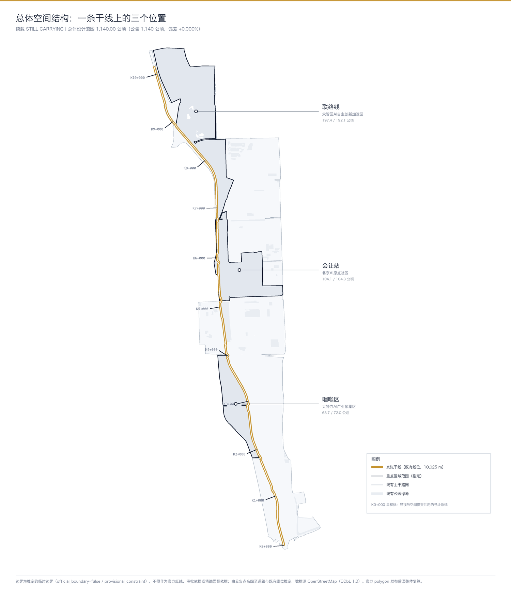
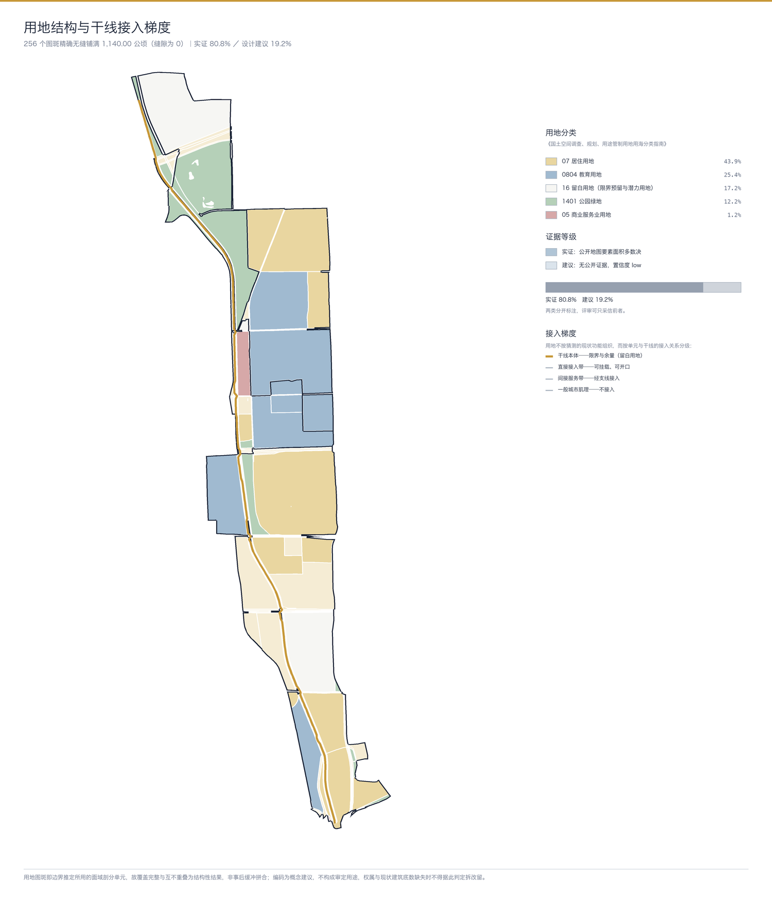
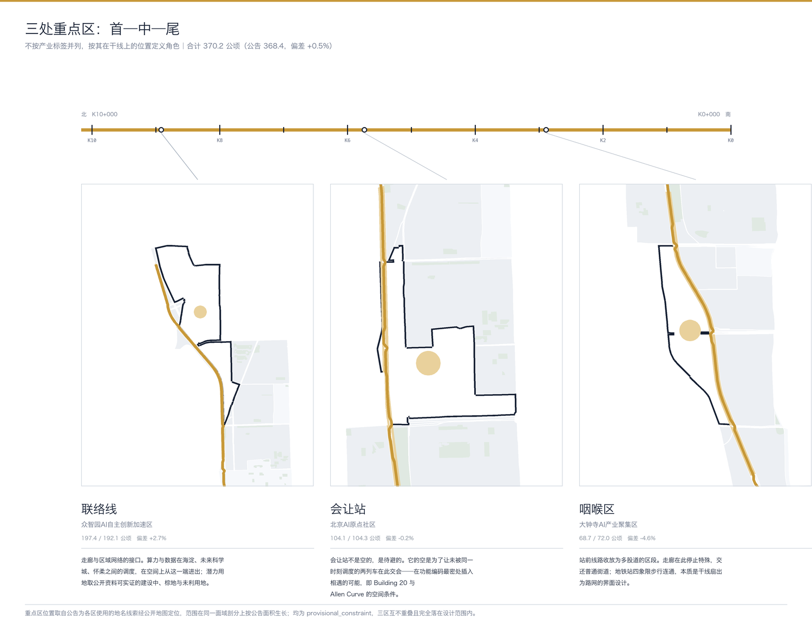
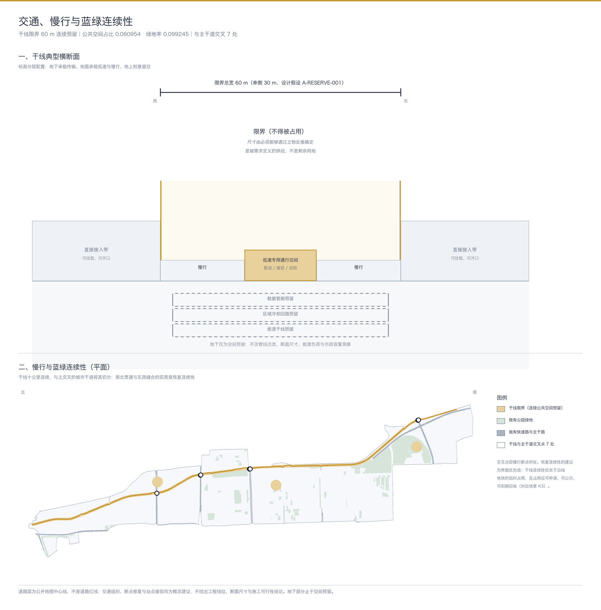
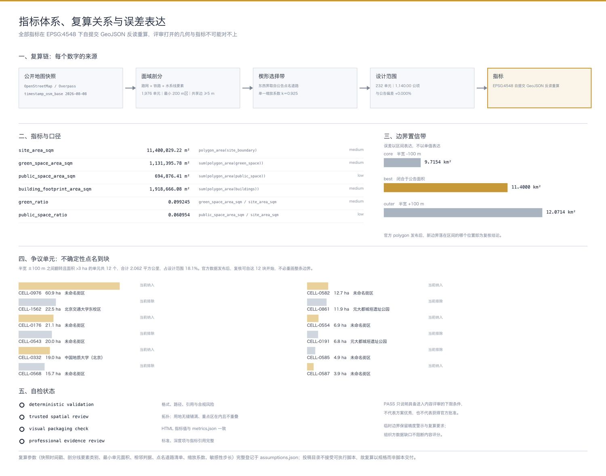

# 续载：百年京张的载与限界

**STILL CARRYING — a line that keeps its load, and keeps its gauge.**

本方案的全部空间落地建议均为概念建议与参考方案，可供专业团队深化研究，不替代法定规划，不构成政府审定结论。

## 设计依据与资料清单

詹天佑修的是基础设施，不是纪念物。遗址公园的通行做法是把停止服役的基础设施审美化——铁轨变成铺装纹样，机车变成雕塑——"百年连续性"于是只剩下修辞。本方案主张相反的路径：让这条走廊继续承载东西。

这个主张不是创意，是有先例的推论。铁路路权在全球范围内被大规模用于铺设长途光纤干线，是互联网骨干网建成的主要方式之一；国内的中国铁通即源自铁道部通信系统。同一条连续线性通道，一百年前运煤运人，此后运元件与代码，今天可以运数据、运算力、运货。传输物变了，承载关系没变。

资料边界据 [source:OFFICIAL-ANNOUNCEMENT] 与 [source:AGENT-TASKBOOK] 划定：公告的三层范围文字四至、约面积、三处重点区名称与南北顺序可作任务依据，但公告未附任何边界图或空间数据。仓库提供的临时粗略几何仅供 intake 与可视化，不得冒充官方红线。

本方案因此自建空间底账。全部提交几何由公开地图数据派生，逐要素标注 `official_boundary=false` 与 `geometry_role=provisional_constraint`，方法与全部参数登记于 [data:geometry/site_boundary.geojson#SITE-001]。数据源为 OpenStreetMap，以 ODbL 1.0 授权，署名与衍生数据库同等开放义务见 [source:OSM-SNAPSHOT-20260808]。

一个可核验的起点：OSM 中标记为 `railway=razed` 且名为京包线的九段历史线位，与现行运营线位平均偏差 3.1 米、最大 8.7 米。两条线基本重合。"这条线一直在那儿"因此是可测量的事实，不是叙事修辞。

## 三层范围工作框架

公告给出三层范围的文字四至与约面积，未给几何。本方案对三层分别处理，处理方式取决于文本能否支撑重建。

**总体设计范围（11.4 平方公里）可以重建。** 公告 1.4.2 点名的四至道路——东至学院路、西土城路，西至大钟寺东路、荷清路——全部可在公开地图中定位。定位后出现一个关键事实：西界自身是西偏的。荷清路在北段自东向西横跨约 1.6 公里，而东界的学院路经度基本恒定。公告描述的因此是一个南窄北宽的楔形，不是一条等宽竖带。

据此建模：以既有线位为中心线，东西边界由点名道路按纬度采样为偏移剖面，全模型只保留一个全局缩放系数，用公告面积闭合。系数落在 0.925——点名道路照字面围出的面积，仅比公告面积大 7.5%。公告的文字四至与面积数是自洽的。结果为 11,400,029 平方米，与公告偏差 +0.000%，详见 [depth:three_level_scope_framework] 与 [metric:site_area_sqm]。

**统筹研究范围（43.6 平方公里）无法重建。** 其四至道路（北五环、京藏高速、西直门外大街、万泉河路）同样全部可定位，且此处不需要任何自由参数。零参数推定得 56.71 平方公里，偏差 +30.06%。诊断分两层：京藏高速与万泉河路同时有定义的纵向区间仅 3.2 公里，占所需 8.7 公里的 37%；但即使在该区间内，四至围出的宽度为 6,261 至 6,840 米，按 8.7 公里纵长约 58 平方公里，仍显著大于 43.6。外插不是唯一原因。

结论写入 [source:BOUNDARY-SOURCE] 对应的假设条目：统筹研究范围在本方案中只按公告文字描述，不给出面积复算结论，不作为任何指标的分母。标量锚点固定为总体设计范围。这不是回避，是把可确定与不可确定分开——把 30% 的不确定性传染给全部派生指标，才是真正的失职。

**重点区域范围（368.4 公顷）按公告地名线索定位。** 三处重点区的位置取自公告自身为各区使用的地名——五环与清河、五道口与清华东路西口、大钟寺站——经公开地图节点定位，范围在同一套面域剖分上按公告面积生长。结果为 197.4、104.1、68.7 公顷，合计 370.2 公顷，与公告 368.4 偏差 +0.5%。

## 统筹研究范围产业与未来城市研究

这一层的任务是判断这条走廊在区域创新体系中承担什么，而不是复述产业门类。

走廊的稀缺性来自几何而非区位。建成区内长度接近十公里、无平交、权属相对集中的连续线性通道，几乎无法再造。这个属性决定了它能承载什么：需要连续路权的东西。低速自动配送与接驳消费的正是连续、无平交、专用这三个属性——而这三个属性正是这条线一百年前的核心资产。医疗导航、企业服务这类场景放在方格网上同样成立，它们不消费走廊的几何。赛道选择 `robotics-autonomous-mobility` 由此而来，不是因为机器人时髦。

区域协同因此有了物理落点。走廊北端在清河一侧与五环、区域干线接壤，是它与更大网络的接口；算力与数据在海淀、昌平未来科学城、怀柔科学城之间的调度关系，在空间上从这一端进出。这是 [data:geometry/key_areas.geojson#KEY-001] 承担的角色。

生态案例的筛选轴据此确定：不看园区名气，看**该创新生态如何分配一项共享的稀缺物理基础设施**。巴塞罗那 22@ 以容积换基础设施与保障房的法定工具、街道下的市政共同沟；伦敦 King's Cross 对既有构筑物的再承载与全街区治理框架；新加坡 one-north 的分期土地单一主体分配；波士顿 Kendall Square 的公共空间义务；赫尔辛基 Kalasatama 的场景开放机制；阿姆斯特丹 Marineterrein 刻意保持低编程度的显式政策；柏林 EUREF-Campus 前燃气厂场地的园区微电网。七个案例的共同点不是产业，是它们都必须回答"谁能占用、占用多久、如何记录"。

上述案例仅引用其公开可查的机制描述，不引用投资额、产值或企业名单；相关约束见 [depth:existing_conditions_diagnosis]。

## 总体设计范围城市更新与控规深度城市设计

总体设计范围的结构由干线组织，三处重点区按其在线上的位置定义角色，而不是按产业标签并列。

自北向南：**联络线**（众智园）是走廊与区域基础设施的接口；**会让站**（AI 原点社区）是全区功能分区最密处的待避与交会段；**咽喉区**（大钟寺）是干线扇出为普通路网、交还常规城市规则的界面。首、中、尾是读一条线上三个点的基础设施式读法，它把公告 1.5.3 的三条独立任务串成同一条论证，见 [depth:overall_spatial_structure]。

按标高分层配置是这条走廊的核心动作：

| 标高 | 承载内容 | 本方案可达深度 |
|---|---|---|
| 地下 | 数据管廊、区域冷却回路、能源干线的**空间预留** | 止于路权与空间预留；不涉管线迁改、断面尺寸、能源负荷与市政容量测算 |
| 地面 | 低速自动配送与接驳的专用通行空间 + 慢行 | 概念性组织建议，不给工程线位 |
| 地上 | 刻意不装 | 交由限界承担，见下节 |

地下这一层是物质层最有说服力也最受资料约束的部分。市政管线、消防、防洪排涝条件均无官方依据，因此本方案的一切表述止于"预留多宽、谁能接入、如何记录"，不进入任何工程结论。这条天花板是设计纪律，不是免责声明——把它写明，方案才可被专业团队接着做，见 [depth:municipal_new_infrastructure]。

开发强度同理。无官方控规条件时，本方案不给出容积率、建筑密度、建筑高度等审定指标，只提出强度随接入关系递减的分区原则与待确认条件清单，见 [depth:development_intensity_controls]。

## 重点区域详细设计

三处重点区共用一套判别逻辑：它与干线的关系决定它做什么。

**众智园 AI 自主创新加速区（联络线，197.4 公顷）。** 北端接五环与清河，是走廊与区域网络的进出口。全栈自主创新体系在空间上表现为算力与数据的接入端，而非一片研发楼。潜力用地不靠猜测圈定：公开地图中标记为建设中、棕地与未利用地的地块，是唯一能被公开资料实证的潜力用地候选，已归入留白用地并落图，见 [data:geometry/land_use.geojson#LU-0001]。清河文化与花园型街区的表达以既有绿地为骨架，不新增未经论证的绿化指标。

**北京 AI 原点社区（会让站，104.1 公顷）。** 这里是全区功能编码最密的地方，高校、企业、公寓三种强分区贴合在一起。会让站是本方案最锋利的一处，也最容易被误读，因此必须把词义说准：会让站不是空的，是**待避**的。它的空是为了让未被同一时刻调度的两列车得以在此交会；"会让"二字的字面义就是会车与让行。它的功能是让本来不会相遇的东西相遇。

这正是创新经济学早已论证过的机制。Jane Jacobs 指出街道的多样性来自未被规划的相遇；MIT Building 20 与 Bell Labs 的经验表明，价值常来自未被指派的邻接；Allen Curve 则给出协作概率随物理距离急剧衰减的关系——物理余量因此是有产出的投入，不是浪费。近校型街区的价值不在于挨着学校，而在于挨着学校却没有被学校的时间表接管的那部分空间。相关空间供给见 [depth:blue_green_public_space]。

**大钟寺 AI 产业聚集区（咽喉区，68.7 公顷）。** 咽喉区是站场术语，指站前线路收放为多股道的区段。走廊在此停止特殊，交还普通街道。公告点名的地铁站四象限步行连通与静态交通组织，本质就是"干线扇出为路网"的界面设计。智能原生业态在这里落地，是因为这里是走廊与日常城市消费流的交接面。

三区面积与公告偏差分别为 +2.7%、−0.2%、−4.6%，来源于剖分单元粒度；三区互不重叠且完全落在设计范围内，见 [depth:three_key_area_detailed_design]。

## AI 创新生态、人才画像与 AI+ 场景

场景在本方案中有统一语法：**每张场景卡是干线上的一次分配事件或一次读取**。占用一条运行线、一个时段、一片界面，就是一次写入；查询与复核，就是一次读取。这个语法保证十张卡不是十个"AI+X"品类填空。

运行线是铁路调度术语，指一列车对线路容量的一次占用，有起讫、时间窗与优先级。它比"路权"精确，也避开了道路交通法规中通行权的法定含义。

| 编号 | 场景 | 类型 | 空间位置 |
|---|---|---|---|
| K1 | 低速配送在专用通行空间的时段申请与放行 | 写入 | 干线全段 |
| K2 | 巡检与清洁机器人的夜间运行线 | 写入 | 干线全段 |
| K3 | 临时活动占用界面的申请、公示与到期自动回收 | 写入 | 三处节点 |
| K4 | 地下预留舱位的接入申请与占用登记 | 写入 | 干线地下 |
| K5 | 慢行断点的居民报修与处理状态回查 | 写入 | 咽喉区 |
| K6 | 走廊当前占用状态的公开查询 | 读取 | 全段 |
| K7 | 空间变更记录的按里程标检索 | 读取 | 全段 |
| K8 | 无障碍路径的实时可达性播报 | 读取 | 会让站段 |
| K9 | 沿线历史线位与站点的导览 | 读取 | 全段 |
| K10 | 低介入段：不排程、不优化、按最小必要原则采集 | 低介入 | 会让站限界内 |

其中 K1、K2、K4 为 AI 产业测试验证场景：它们需要在可控范围内验证调度、避让与接入协议，且都必须保留人工复核与回滚通道。测试场景不等于已批准运营。

第十项需要说明。它不是"什么都不发生"，而是一段被显式声明为**不排程、不优化**的空间。数据处理按《中华人民共和国个人信息保护法》确立的最小必要原则组织，并按数据分类分级确定采集等级；本方案称之为低采集分级区，可用覆盖率计量。写成"无采集区"是错的——那是法律读法有风险的表述，也不是设计要表达的意思。设计要表达的是：可读写的系统必须留出不被写入的余地。

五类用户画像按**他们能对走廊写入什么**区分，不按职业标签：一，日常占用者（配送与巡检的机器及其运营方），高频、窄权限；二，街区居民，可对物理空间提出问题，低频、宽范围；三，创业团队与开发者，申请临时权限窗口做测试；四，高校研究者，以读取为主，且审计日志本身是其研究材料；五，运维与复核方，持有回滚权限——这一类由 [source:AGENT-TASKBOOK] 第七条共创原则要求，人类保留最终判断。

场景、空间与运营的映射关系落在 [data:geometry/public_space.geojson#PS-0001] 与 [metric:public_space_ratio] 上：所有写入型场景都占用限界内的容量，而限界的总量是有上限的——这使"谁能写入"成为一个可计量的分配问题，而不是一句原则。

## 用地、建筑规模与拆改留方案

用地布局与边界推定共用同一套面域剖分：被选入设计范围的剖分单元，经限界带切分后，本身就是用地图斑。覆盖完整与互不重叠因此是结构性的，不是事后用缓冲区凑出来的。全域 256 个图斑精确铺满 11,400,029 平方米，缝隙为 0，见 [depth:land_use_layout]。

分类按《国土空间调查、规划、用途管制用地用海分类指南》编码，并逐图斑标注证据等级：80.8% 由公开地图的用地、设施与绿地要素按面积多数决支撑，标注为 `osm_evidenced`；19.2% 无公开证据，标注为 `design_proposal`、置信度 low。把这两类混在一起呈现，是本类方案最常见的失真来源；分开标注之后，评审可以只采信前者。

一个术语选择值得说明：留白用地（代码 16）是现行分类中的正式类别。本方案的限界预留因此不是自创指标，而是有法定用地代码的用地命题——这一点使"留出不被占用的余量"从设计姿态变成可编码、可审的内容，见 [standard:MNR-LAND-USE-CLASSIFICATION-GUIDE]。留白用地由两部分构成：干线限界预留（设计建议），以及公开资料实证的建设中、棕地与未利用地（潜力用地候选）。

建筑层为公开地图的建筑基底，1,478 个图形，总基底面积见 [metric:building_footprint_area_sqm]。它没有高度、层数、用途与建成年代——因此本方案不编造任何建筑高度或层数，风貌控制改以界面连续性、限界断面与沿线视线关系表达，见 [depth:height_massing_character]。

拆改留同理。地块权属与宗地边界缺失，故本方案只提出低扰动更新的判别原则——优先利用已实证的潜力用地、优先在不改变权属的前提下调整界面与首层功能——不指定任何具体地块的拆除或保留结论，见 [depth:retain_renovate_demolish]。

## 交通、轨道、市政与公共服务设施

道路层为公开地图的中心线，619 条，按枚举映射为快速路、主干路、次干路、支路与慢行类别。**它不是道路红线。** 道路红线与断面无官方依据，因此交通组织全部表述为概念建议，不给工程线位与施工可行性结论，见 [depth:traffic_rail_slow_parking]。

慢行系统的核心问题是断点。走廊十公里连续，但与之交叉的城市干道把它切成若干段；南北贯通与东西缝合的实质，是在不新增平交冲突的前提下恢复连续性。本方案将其表述为界面优先级建议：干线连续性优先于沿线地块的临时占用，且任何占用都应可申请、可公示、可到期回收——这与场景 K3 是同一机制的两种表述。

轨道接驳集中在三处节点。大钟寺站的四象限步行连通是公告点名任务，在本方案中即咽喉区的界面设计：干线在此扇出，行人流线随之分叉。站点一体化改造涉及既有工程与权属，本方案不作已批准工程的任何暗示。

市政与新型基础设施按上节的标高纪律处理，止于空间预留与接入规则。公共服务设施底数缺失，故只提出服务体系与待核设施清单，不编造学校、医疗、养老容量。

## 蓝绿空间、公共空间与城市风貌

绿地层取公开地图既有公园裁切至设计范围，60 个图形，绿地率见 [metric:green_ratio] 与 [metric:green_space_area_sqm]。这是既有条件，不是本方案新增的绿化承诺。

公共空间层是本方案的设计供给：干线限界连续预留，加三处节点。限界单侧 30 米、总宽 60 米，这个数字不是从剩余用地里量出来的，而是由**必须能够通过之物**反推确定——低速专用通行空间、慢行、地下干线的竖向投影、待避与交会空间。这正是铁路建筑限界的定义方式：限界尺寸由须通过的车辆轮廓决定。**这块预留空间是被需求定义的供给，不是剩余。** 面积与占比见 [metric:public_space_area_sqm] 与 [metric:public_space_ratio]。

三处 AI 朝圣地标即干线的三个功能位，各自回答一个不同的问题：

- **联络线（众智园）**——走廊与区域网络的接口，也是走廊当前占用状态的物理界面：此刻哪条运行线被谁占用、还剩多少余量，在此可读。
- **会让站（AI 原点社区）**——待避与交会的构筑物。它不提供节目单，提供的是相遇的概率。反打卡、反网红是它的设计前提，不是副作用。
- **咽喉区（大钟寺）**——干线规则终止、常规城市规则接管的门槛标记。

荣誉与贡献展示不做企业标识墙。走廊沿线以里程标桩号（K0+000 起算）作为统一寻址系统，任何一次空间变更、任何一位贡献者，都获得一个永久桩号地址。导视系统与提交记录的寻址方案因此是同一套——这既是 agent.5 要求的标识系统方向，也是信息层的地址空间。

命名与视觉识别同源。主名称"续载"取"载"字的双关：承载与记载。英文名 STILL CARRYING 用现在进行时承担连续性论证。全部子元素采用京张自身的运营词汇——运行线、占用检查、限界、会让站、联络线、咽喉区、里程标——不发明新词。Logo 方向为建筑限界断面轮廓：一条封闭剖面线界定一个必须为空的体积，标志本身是"空"的边界，可在地下、地面、地上三档分别填充构成子标识。已剔除的候选词及其理由（净空、路权、闭塞、接轨）随方案一并提交，因为把没选的词和不选的理由摆出来，本身就是本方案主张的取舍纪律。

百年文化叙事由此收束：这条线一直在传输东西，中关村只是它的一个中间态。人字形不作形状化使用——它是坡度约束下以折返换牵引力的工程权衡，一次带着约束条件做出的、可复核的取舍。国际传播文案以 STILL CARRYING 与副题为核心，不使用未经授权的商标、字体、肖像与论文图像。

## 更新项目清单、实施政策与分期计划

分期按干线组织，不按投资时序编造：

| 期 | 段落 | 内容 |
|---|---|---|
| 一期 | 会让站段 | 中段最稠密处先做限界与待避空间，验证低介入段与余量率口径 |
| 二期 | 联络线段 | 北端接区域基础设施，打通干线进出口与算力/数据调度接口 |
| 三期 | 咽喉区段 | 南端干线扇出为普通路网，完成四象限步行连通与静态交通组织 |

先做中段是有理由的：会让站是全案唯一需要论证的动作，也是最容易被误解的动作。它先落地并产出可核验的指标，后两期才有依据。分期落图见 [depth:phasing_implementation]。

更新项目清单只列公开资料能实证的潜力用地候选，不含权属判断，见 [depth:renewal_project_list]。

长期运营的核心主张是：**治理即运营，分配即运营**。年度活动体系锚在里程标与三处节点上，不办悬空的大会；开发者社区的运营对象是走廊的接入协议与占用记录，贡献以桩号沉淀；场景开放运营即上节十张场景卡的申请、公示、到期回收与人工复核流程。

**余量率是 KPI**——设计范围内被显式声明为不分配的容量占比。这条反直觉但可辩护：余量是相遇的前提，而相遇是创新经济学早已确认的产出来源。它与招引转化路径并列，不替代后者：人才、企业与开发者的后续转化仍须有明确通道，包括测试窗口申请、成果在走廊上的展示位分配，以及从测试场景转为常态运营的审批路径。上述活动、政策与机制均为建议，不构成已确定的政府安排或资金承诺。

## 指标体系、面积复算与合规矩阵

全部指标在 EPSG:4548 下自提交的 GeoJSON **反读重算**，而不是沿用生成脚本的内存值——这样评审打开的几何与指标不可能对不上，见 [depth:metrics_recalculation]。

| 指标 | 值 | 口径 |
|---|---|---|
| 设计范围面积 | 11,400,029 m² | 与公告 11.4 km² 偏差 +0.000% |
| 绿地率 | 0.099245 | 既有公园裁切 ÷ 设计范围 |
| 公共空间占比 | 0.060954 | 干线限界与节点 ÷ 设计范围 |
| 建筑基底面积 | 1,918,666 m² | 公开地图建筑基底裁切 |
| 重点区合计 | 370.2 ha | 与公告 368.4 ha 偏差 +0.5% |

**误差以区间而非单值表达。** 半宽 ±100 米对应 core 9.72 平方公里、best 11.40、outer 12.07。更要紧的是不确定性的分布形态：它不是均匀边带，而集中在少数不可分割的大单元上。在 ±100 米之间翻转且面积超过 3 公顷的单元共 12 个，合计 2.062 平方公里，占设计范围 18.1%，其中可具名者包括北京交通大学东校区、中国地质大学（北京）与元大都城垣遗址公园。清单落图于 [data:geometry/constraints.geojson#CB-CORE]。

这个表达方式的实用价值在于：官方 polygon 发布后，复核可以从这 12 块具体地块开始，而不必重画整条边界。"正式数据发布后需重新复算"因此不是免责声明，而是一份可执行的工作清单。

复算规格随包提交。投稿目录不接受可执行脚本，故全部参数——数据快照时间戳、剖分线要素类别、最小单元面积、相邻判据、点名道路清单、缩放系数、敏感性步长——登记于 assumptions.json，任何具备同一快照的团队可重现全部几何与指标。

任务响应的完整映射见 compliance_matrix.json，覆盖公告 1.3 至 1.5 与 agent.1 至 agent.6 共 23 条；专业深度见 design_depth_matrix.json 共 15 项；标准依据见 standard_matrix.json，含 [standard:MOHURD-URBAN-DESIGN-MEASURES] 与 [standard:MOHURD-CONTROL-DETAILED-PLANNING]。

## 风险、版权与合规说明

**资料缺口决定了本方案能说什么。** 九项官方资料缺口逐条登记于 assumptions.json，每条都写明它对可陈述内容的限制，而不是仅作免责：三层范围与重点区官方红线缺失，故全部几何标注为临时；控规条件缺失，故不给开发强度结论；道路红线与断面缺失，故交通只作概念组织；地块权属与现状建筑底数缺失，故不指定拆改留；文保控制范围缺失，故清华园车站旧址周边一切地下与近接动作列为待补条件；市政、消防与防洪条件缺失，故地下部分止于空间预留；公共服务设施底数缺失，故不编造设施容量。

**主要风险与应对。** 边界推定风险：18.1% 的面积落在争议单元中，已点名到块，官方数据发布后逐块复核。技术成熟度风险：低速自动驾驶场景须保留人工复核与回滚通道，不得写成已可全面部署。公众接受度风险：会让站的价值不易直观感知，故以余量率与低采集分级区覆盖率两项可复算指标支撑，而非依赖叙述。数据隐私风险：低介入段按最小必要原则与分类分级组织，全部场景保留人工复核。政策不确定性风险：全部机制建议不构成政府承诺。

**版权与授权。** 空间数据来自 OpenStreetMap，以 ODbL 1.0 授权，本方案履行署名义务，并声明由其派生的 geometry 构成衍生数据库，随本仓库以同等条款公开，见 [source:OSM-DERIVED-CORRIDOR-20260808]。方案未使用商业地图截图、非公开规划图件、个人隐私数据或未授权的字体、商标、肖像与论文图像。详细声明见 report/copyright_statement.md。

**边界条款。** 本方案全部空间落地、活动运营、品牌传播与政策机制建议均为概念建议与参考方案，可供专业团队深化研究。方案不替代法定规划，不越过政府审定与法定审批；提交日志与权限模型是在法定程序之外增设的公共可见层，不替代、不前置于法定程序，最终判断由人类与专业团队完成。

## 参考资料

- 《百年京张AI创新带城市设计国际方案征集资格预审公告》，北京市规划和自然资源委员会海淀分局，2026-05-09。三层范围文字四至、公告面积、三处重点区名称与设计任务的唯一依据。见 [source:OFFICIAL-ANNOUNCEMENT]。
- 面向全球智能体开源征集任务书摘录，见 [source:AGENT-TASKBOOK]：十条共创原则、六项 agent 任务、评审维度与统一边界条款。
- OpenStreetMap 数据快照，经 Overpass API 获取，ODbL 1.0，© OpenStreetMap contributors。路网、铁路、水系、绿地、用地、建筑与地名节点，逐图层记录 `timestamp_osm_base`。见 [source:OSM-SNAPSHOT-20260808]。
- 《城市设计管理办法》与《城市、镇控制性详细规划编制审批办法》，用于城市设计与控规深度的语言边界，不用于证明本项目已有法定控规调整。
- 《国土空间调查、规划、用途管制用地用海分类指南》，用地代码与分类术语依据，包括本方案大量使用的留白用地（16）类别。
- 仓库处理资料包 `data/processed/`，作为任务、范围、资料用途与缺口的导航层，见 [source:PROCESSED-FACT-PACK]；一切事实判断仍回到原始来源。
- 创新经济学引证：Jane Jacobs 关于街道多样性与未被规划的相遇；MIT Building 20 与 Bell Labs 的弱连接经验；Allen Curve 关于协作概率随距离衰减的关系。三者用于论证物理余量的产出属性。
- 线性基础设施再承载谱系：铁路路权铺设长途光纤干线的产业史（含中国铁通源自铁道部通信系统）、Atlanta BeltLine、首尔京义线林荫道、巴黎 Promenade Plantée 与 Viaduc des Arts，以及作为反面教材的纽约 High Line——其绅士化与沦为纯消费景观的过程，正是本方案物质层要避开的结局。
