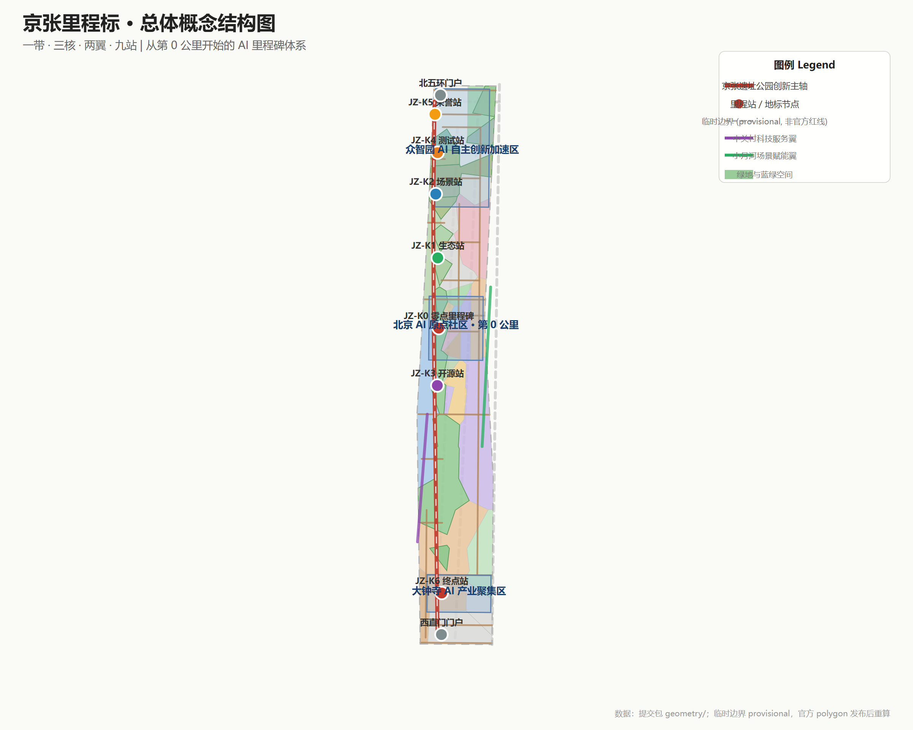
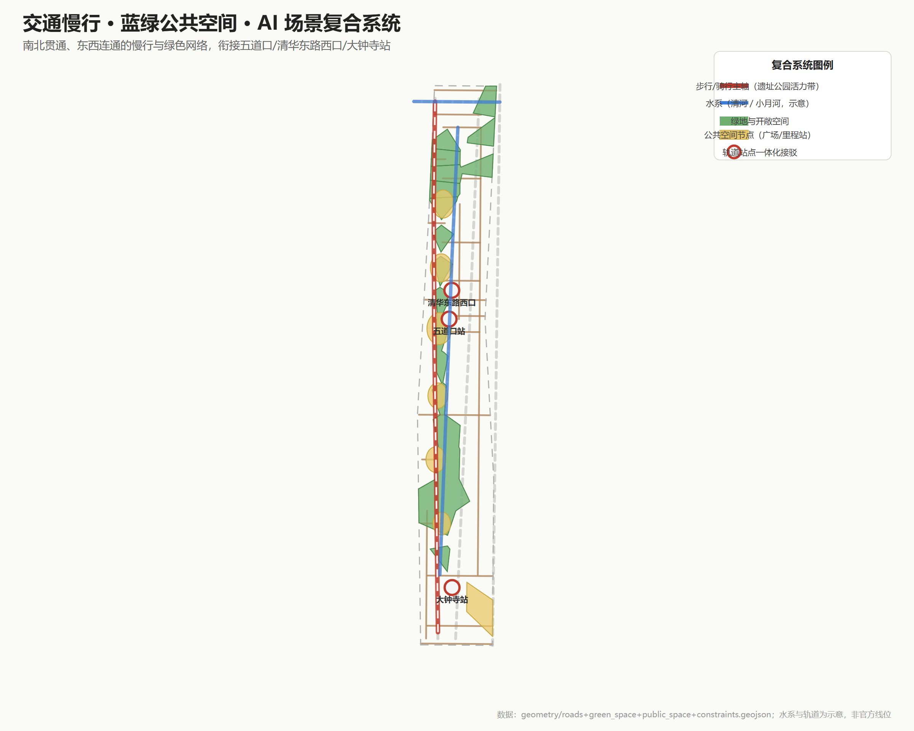
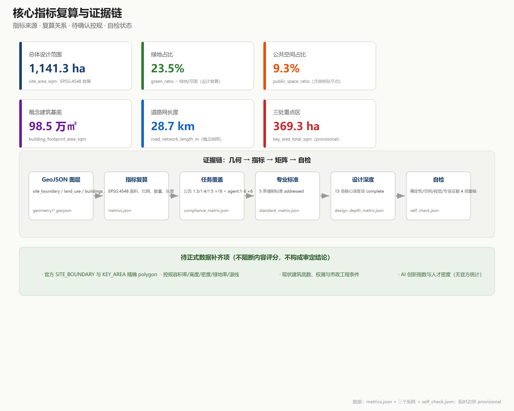

# 京张里程标：从第0公里到世界级AI创新带

## 设计依据与资料清单

本方案以北京市规划和自然资源委员会海淀分局发布的《百年京张AI创新带城市设计国际方案征集资格预审公告》为第一依据，该公告确定了三层范围、三处重点区域、约 43.6/11.4 平方公里与 368.4 公顷的规模框架，以及达到控制性详细规划与规划综合实施方案的城市设计深度 [source:OFFICIAL-ANNOUNCEMENT]。面向全球智能体的开源征集任务书补充了三大定位、五大功能、三区两翼、六项智能体任务与统一边界条款，本方案将其作为概念、场景、品牌与运营设计的直接任务来源 [source:AGENT-TASKBOOK]。场地包（`brief/site-package/`）提供的枚举、允许设计空间、规划限值、schema 与本地标准参考，是本方案所有机器可读文件的书写规范 [source:SITE-PACKAGE]。

公开资料登记表是本方案区分资料用途的边界依据：只有 `usable_for_formal="yes"` 的来源可用于正式结论，background_only 与 provisional_only 资料只能用于背景叙述、临时生成与设计讨论 [source:SOURCE-REGISTRY]。本方案所有空间结论均基于仓库登记的可公开资料或用户提供且已清权资料，未使用、也未声称使用任何非公开规划图件或内部控制指标。

当前仓库尚未取得官方精确红线与三处重点区官方 polygon，因此本方案按规则使用 `brief/site-package/geometry/provisional_boundaries.geojson` 中明确标注的 `provisional_constraint` 边界生成临时 formal 包 [source:BOUNDARY-SOURCE]。该边界仅用于方案生成、自检、可视化与设计讨论，不构成 official redline、审批依据或精确面积依据；官方 polygon 发布后，site boundary、key areas、land use、roads、green space、public space、buildings、phasing 与全部空间指标均需统一重算 [source:KEY-AREA-SOURCE] [depth:three_level_scope_framework]。

总体设计范围的面积复算结果保存在 [data:geometry/site_boundary.geojson#SITE-001] 与 [metric:site_area_sqm]；三处重点区由 `key_areas.geojson` 中的 PROV-KEY-001/002/003 三个要素表达，数量由 [metric:key_area_count] 核对。完整的来源、指标、标准、设计深度与任务覆盖索引分别保存在 `sources.json`、`metrics.json`、`compliance_matrix.json`、`standard_matrix.json` 与 `design_depth_matrix.json`，正文不重复机器索引。

## 三层范围工作框架

方案按公告确定的三个层次组织工作，三层不是互相割裂的图纸集合，而是从产业战略到详细设计的逐级传导 [depth:three_level_scope_framework]。

**统筹研究范围（约 43.6 平方公里）**回答"AI 创新带为什么在这里、与世界相比如何"：研究海淀 AI 产业基础、三区两翼协同、创新链与产业链组织方式，以及 AI 时代的城市形态方向。本层的产出是产业与未来城市策略、命名体系与生态图谱，落到 `compliance_matrix.json` 与 `standard_matrix.json` 的任务响应中，不新增任何红线。

**总体设计范围（约 11.4 平方公里）**回答"更新如何发生"：以京张遗址公园为主轴，组织用地、建筑、道路、绿地、公共空间与分期图层，形成达到控制性详细规划城市设计深度的更新框架 [data:geometry/land_use.geojson#LU-001] [depth:overall_spatial_structure]。本层所有面积与比例均可从提交几何复算（[metric:site_area_sqm]、[metric:green_ratio]、[metric:building_footprint_area_sqm]），涉及控规、高度、密度、红线的结论一律以待正式条件标注。

**重点区域范围（约 368.4 公顷）**回答"三个核心里发生什么"：众智园AI自主创新加速区、北京AI原点社区、大钟寺AI产业聚集区分别形成"定位＋空间结构＋建筑更新＋交通慢行＋公共空间＋AI场景＋实施风险"的可读小方案 [depth:three_key_area_detailed_design]，对应 [data:geometry/key_areas.geojson#PROV-KEY-001] [data:geometry/key_areas.geojson#PROV-KEY-002] [data:geometry/key_areas.geojson#PROV-KEY-003]。

| 层级 | 设计问题 | 本方案回答 | 数据落点 |
| --- | --- | --- | --- |
| 统筹研究范围 | AI产业生态与未来城市形态 | 里程标生态图谱：高校策源—开源协作—企业转化—公共体验—国际传播 | compliance_matrix.json、standard_matrix.json |
| 总体设计范围 | 更新如何落图 | 一带·三核·两翼·九站空间结构，用地/建筑/道路/绿地/分期图层共同表达 | [data:geometry/land_use.geojson#LU-001]、[data:geometry/roads.geojson#ROAD-001] |
| 重点区域范围 | 三个核心里发生什么 | 0 公里原点、全栈加速里程、城市终点站三份详细设计 | [data:geometry/key_areas.geojson#PROV-KEY-001] [data:geometry/key_areas.geojson#PROV-KEY-002] [data:geometry/key_areas.geojson#PROV-KEY-003] |

三层范围均使用 provisional 边界。正文、HTML、sources、assumptions 与 self_check 已醒目标注该限制：边界精度为 `provisional_rough`，替换官方 polygon 后需要重算的图层与指标清单见 `assumptions.json`，该数据缺口本身不阻断内容评分。

## 统筹研究范围产业与未来城市研究

### 总体概念：京张里程标（Jing-Zhang Mileposts）

京张铁路是中国自主设计建造的第一条干线铁路，沿线每一公里都设有里程碑——它们丈量的不只是铁轨的长度，更是中国人自主创新的第一段里程。百年之后，AI 创新带把"里程"重新发明为"里程碑"：**沿着京张遗址公园主轴，把每一公里转化为一个可标记、可庆祝、可追溯的 AI 创新节点** [source:AGENT-TASKBOOK] [standard:PROJECT-AGENT-OPEN-CALL-TASKBOOK]。

- **物理里程标**：沿公园主轴设置的公共空间装置网络，每个里程站承载一处主题（开源、生态、场景、荣誉、测试、国际），是"AI 时代丈量自己进步"的实体尺度；
- **数字里程标**：一套开源里程碑协议——带内开源项目、AI 模型、场景测试达到既定节点即"点亮"对应数字里程，与 GitHub Milestone 同构，让贡献可被版本化记录；
- **文化里程标**：把京张铁路 1909 年通车、中关村创新创业、AI 新文化组织成一条百年时间线，用里程站的导视与展陈让历史可步行、可阅读。

三处重点区在里程标体系中各有一个身份：**北京AI原点社区是"第 0 公里"（JZ-K0）**——一切创新从这里起步，零点里程碑是精神原点；**众智园是全栈加速里程段（JZ-K4/K5）**——标准、安全治理与全栈自主创新在这里接受检验；**大钟寺是"城市终点站"（JZ-K6）**——智能原生新业态与国际交往在这里面向世界。中关村科技服务翼与中央创新轴、小月河场景赋能翼构成"两翼"，支撑创新要素全球化配置与 AI 场景落地 [source:OFFICIAL-ANNOUNCEMENT]。

### 命名体系与 Logo 方向

- 主名称：**京张里程标**；英文名：**The Jing-Zhang Mileposts**（缩写 **JZ-MP**）；
- 定位语（中文）：**从第 0 公里开始**；
- 定位语（英文）：**Every mile, a milestone.**
- 里程刻度体系：JZ-K0（原点）→ JZ-K1 生态站 → JZ-K2 场景站 → JZ-K3 开源站 → JZ-K4 测试站 → JZ-K5 荣誉站 → JZ-K6 终点站；刻度是"创新里程"的概念符号，不代表实测公里数；
- Logo 方向：以铁路里程碑石墩轮廓为基底，内嵌"0.0 km"数字显示与轨道/代码双线符号，支持深色碑刻与浅色数字两种场景；视觉系统采用"米白底、铁锈红（京张铁路）＋代码绿（AI）＋石青灰（中关村）"三色识别体系。命名、Logo 与视觉元素均为概念方向，未使用任何未授权字体、商标或企业标识 [source:AGENT-TASKBOOK]。

### 五大功能与三区两翼协同回路

方案把五大功能映射到空间与机制：**AI全栈自主创新体系**由众智园全栈加速里程承担（标准制定、安全治理、模型测试）；**世界级AI创新生态**由 0 公里原点社区的"高校策源—成果转化—开源协作"回路承担；**AI+场景赋能新范式**由小月河场景赋能翼的测试验证场景承担；**智能化AI活力城市**由都市AI生活体验带的公共场景承担；**AI治理全球话语权**由"数字里程标协议"承担——把开源里程碑、人工复核、红队测试沉淀为可对外输出的治理方法 [standard:PROJECT-AGENT-OPEN-CALL-TASKBOOK]。三区两翼的协同回路为：高校与科研机构（策源）→ 原点社区（转化与开源）→ 众智园（加速与治理）→ 大钟寺（产业与国际）→ 两翼（服务与场景），循环回流至新的策源需求 [source:OFFICIAL-ANNOUNCEMENT]。

### 全球 AI 创新生态案例（5-8 个）

| # | 案例 | 可借鉴经验 | 在海淀的转化机制（概念建议） |
| --- | --- | --- | --- |
| 1 | 伦敦国王十字（King's Cross）更新 | 铁路遗产区整体更新为知识创新区，TOD＋创意产业＋总部办公复合 | 京张遗址公园沿线更新最重要类比；"遗址公园—创新街区"一体化开发模式 |
| 2 | 剑桥 Kendall Square | 近校创新、生物科技与 AI 集聚、高密度创新交往空间 | 原点社区"近校型"空间组织与成果转化服务链 |
| 3 | 硅谷斯坦福研究园 | 大学策源—风险资本—产业聚集的闭环 | 中关村科技服务翼的资本与 IP 服务机制 |
| 4 | 杭州梦想小镇/未来科技城 | 人才特区、数字经济生态、低成本起步空间 | 人才公寓＋孵化器＋场景开放的组合供给 |
| 5 | 新加坡裕廊创新区（JID） | 国家层面测试场与政府—产业—学术协作 | 众智园全栈测试场与标准治理沙盒 |
| 6 | 多伦多 AI 集群 | AI 产业与伦理治理话语权同步构建 | 数字里程标协议的治理输出机制 |
| 7 | 赫尔辛基城市数据开放 | 城市智能体与公共数据治理实践 | 城市智能体治理台与公开资料复核机制 |

这些案例只提炼机制，不引用未清权的企业名单、投资额或产值数据；任何转化为空间、运营与场景的机制均以概念建议表述 [standard:PROJECT-AGENT-OPEN-CALL-TASKBOOK]。产业策略最终落到可见、可复核的空间结构：用地图层表达功能分区 [data:geometry/land_use.geojson#LU-001]，公共空间图层表达交往网络 [data:geometry/public_space.geojson#PUBLIC-001]，蓝绿图层表达连续绿色体系 [data:geometry/green_space.geojson#GREEN-001]，专业统筹依据 [standard:MOHURD-URBAN-DESIGN-MEASURES]。

## 总体设计范围城市更新与控规深度城市设计

### 空间结构：一带·三核·两翼·九站

总体设计范围以**京张遗址公园创新主轴**为骨架（一带），串联**三处重点核心**，衔接**中关村科技服务翼与小月河场景赋能翼**（两翼），沿主轴设置**九个主题里程站**（九站，概念建议）：JZ-K0 零点里程碑（原点社区）、JZ-K1 生态站（清河界面）、JZ-K2 场景站（小月河）、JZ-K3 开源站（北航北邮段）、JZ-K4 测试站（众智园南）、JZ-K5 荣誉站（众智园北）、JZ-K6 终点站（大钟寺），以及两处门户节点（北五环门户、西直门门户）[depth:overall_spatial_structure]。

主轴不是新画红线，而是把遗址公园的南北贯通、东西缝合目标转译为慢行、绿地、公共空间与 AI 场景的复合系统：公园两侧低效空间识别为更新对象，校区、园区、街区通过步行与骑行缝合，轨道站点（五道口、清华东路西口、大钟寺）成为里程站的一体化接驳点 [standard:MOHURD-CONTROL-DETAILED-PLANNING]。总体用地布局见 [data:geometry/land_use.geojson#LU-001]，分期范围见 [data:geometry/phasing.geojson#PHASE-001]。

### 产业目标、功能布局与创新指标体系

结合海淀"1+X+1"产业体系与"AI+"垂直应用方向，方案提出三核的功能比例构想（概念建议）：原点社区以**文化展示与成果转化**为核心（文化用地 0803 与教育用地 0804 主导），众智园以**科研与全栈加速**为核心（科研用地 0802 主导），大钟寺以**商业服务业与智能经济**为核心（商业用地 05 主导）[source:OFFICIAL-ANNOUNCEMENT]。提交几何中科研用地约 145 万平方米、教育用地约 247 万平方米、商业服务业用地约 125 万平方米 [metric:scientific_research_land_area_sqm] [metric:education_research_land_area_sqm] [metric:commercial_land_area_sqm]，这些复算值为设计讨论提供数量级依据；AI 创新指数、人才密度、产值规模等指标无官方统计支撑，列于 [metric:ai_innovation_index]、[metric:talent_density] 为待正式校准项，不虚构数值。

### 更新总体框架

更新框架按"保留—改造—更新—留白"四类组织（概念建议）：**保留**京张铁路遗址、清华园车站旧址（示意保护范围见 [data:geometry/constraints.geojson#CONSTR-07]）与现状高校科研建筑；**改造**低效产业空间与老旧社区服务设施；**更新**产业载体、慢行断点与公共空间节点；**留白**暂无条件判断的地块（约 19.5 万平方米留白用地 [data:geometry/land_use.geojson#LU-001]，待权属与控规条件确认）。更新项目的功能与业态、AI 企业聚集目标、产业空间规模均作为概念建议提出，实施政策与分期见"更新项目清单、实施政策与分期计划"一章 [depth:retain_renovate_demolish]。

### 建筑总规模与承载能力

提交几何中概念建筑基底合计约 98.5 万平方米 [metric:building_footprint_area_sqm]，设计密度约 8.6% [metric:building_density]，仅为空间组织讨论提供量级参考。容积率、建筑高度、建筑密度、绿地率、退线等管控指标在官方控规发布前一律标注为**待正式控规条件确认**，不得伪装为审定指标 [standard:MOHURD-CONTROL-DETAILED-PLANNING]。交通、轨道、市政与配套设施的空间布局见下一章与"交通、轨道、市政与公共服务设施"章 [depth:traffic_rail_slow_parking] [depth:municipal_new_infrastructure]。

## 重点区域详细设计

三处重点区域均使用 provisional 多边形，所有结论为方向性设计；官方 polygon 发布后需按新边界重做几何、指标与图纸 [data:geometry/key_areas.geojson#PROV-KEY-001] [depth:three_key_area_detailed_design]。

### 众智园AI自主创新加速区——"全栈加速里程段"（JZ-K4/K5）

- **定位**：花园型全栈自主创新街区，国家人工智能平台的加速与治理实验段。
- **空间结构**：以清河界面为生态基底（概念建议：清河低碳创新廊 [data:geometry/green_space.geojson#GREEN-001]），以科研用地为产业主体，五环界面以防护绿地过渡；对外交通结合北五环与京藏高速走廊提出优化方向。
- **建筑更新**：科研、实验室、孵化器与人才公寓混合布局（概念建议），现状建筑底数待官方数据补齐。
- **交通慢行**：主轴北段接入五道口方向慢行网络，清河沿岸设滨水步道。
- **公共空间**：全栈测试场（模型标准评测、红队测试、安全治理沙盒展示）与产业展示功能结合 [source:AGENT-TASKBOOK]。
- **AI 场景**：JZ-T1 全栈测试场（产业测试验证）、JZ-05 清河低碳创新廊。
- **实施风险**：清河蓝线、生态与防洪条件待确认；国家平台相关设施与建设时序受上级安排约束。

### 北京AI原点社区——"第 0 公里"（JZ-K0）

- **定位**：近校型人工智能创新街区，清华、北大、中科院原始创新的策源转化原点，也是整个里程标体系的零点。
- **空间结构**：以零点里程碑广场为核心（[data:geometry/public_space.geojson#PUBLIC-SPINE-0KM]），文化展示用地组织成果发布与开源协作，教育科研用地衔接高校，居住与社区服务用地保障人才生活 [data:geometry/land_use.geojson#LU-001]。
- **建筑更新**：提出低扰动、有机更新模式（概念建议）：首层以成果展示、发布、孵化与社区服务为主，上层为人才公寓与小型办公；清华园车站旧址周边保持文保敏感设计（示意保护范围 [data:geometry/constraints.geojson#CONSTR-07]）。
- **交通慢行**：围绕五道口、清华东路西口轨道站点一体化设计，校区—园区—街区慢行缝合 [source:OFFICIAL-ANNOUNCEMENT]。
- **公共空间**：零点里程碑装置、开源成果展示廊、贡献者荣誉墙（概念建议）。
- **AI 场景**：JZ-0KM 零点发布厅（产业测试验证）、JZ-06 成果转化街。
- **实施风险**：校区边界、权属与首层业态调整需多方协调；低扰动更新依赖产权协同机制。

### 大钟寺AI产业聚集区——"城市终点站"（JZ-K6）

- **定位**：城市型智能经济街区，智能体、智能终端、内容消费等 AI 原生与 AI+ 融合新业态的展示、交易与国际交往界面。
- **空间结构**：以大钟寺站为核心组织四象限步行连通（概念建议，[data:geometry/public_space.geojson#PUBLIC-001]），商业服务业用地承载智能原生消费 [data:geometry/land_use.geojson#LU-001]，规划绿地复合利用为公共体验空间。
- **建筑更新**：重点企业周边公共环境品质提升、潜力地块功能研判（概念建议），商业服务业与科研办公混合。
- **交通慢行**：大钟寺站一体化方案、四象限步行连通、非机动车停放与静态交通组织（概念建议）[source:OFFICIAL-ANNOUNCEMENT]。
- **公共空间**：国际路演客厅、数据要素会客厅（概念建议）。
- **AI 场景**：JZ-03 国际路演客厅、JZ-04 数据要素会客厅。
- **实施风险**：轨道站点改造与道路交叉口工程条件待确认；企业建筑与权属空间不得擅自改造。

## AI 创新生态、人才画像与 AI+ 场景

### 六类用户画像

| 用户画像 | 典型需求 | 空间响应（概念建议） | 隐私与自检边界 |
| --- | --- | --- | --- |
| 开源开发者 | 发布、协作、测试、社区声誉、贡献被记录 | 原点社区零点发布厅、开源成果展示廊、贡献者里程碑装置、夜间协作空间 | 不采集个人行为轨迹，活动数据仅聚合统计 |
| AI 初创团队 | 低成本办公、算力入口、产品试验场、政策服务 | 众智园共享测试场、端侧算力驿站、孵化器与人才公寓组合 | 算力与数据服务另行授权 |
| 头部企业访客与高管 | 展示、洽谈、国际接待、人才招聘 | 大钟寺国际路演客厅、轨道站点接驳、重点企业周边公共空间 | 企业标识与案例须清权 |
| 高校师生与科研人员 | 成果转化、跨校协作、日常慢行、学术交流 | 校区-园区慢行缝合、成果转化街、AI 教育体验点 | 校园数据与科研成果需授权 |
| 周边居民 | 通勤、休闲、社区服务、低扰动更新 | 遗址公园慢行环、社区服务嵌入、夜间照明分级 | 不将居民画像用于商业推荐 |
| 城市管理者与治理者 | AI 治理、场景监管、公开决策、公众参与 | 城市智能体治理台、里程标协议评审节点 | 治理数据公开、人工复核兜底 |

六类画像覆盖任务书要求的不少于 5 类用户画像，场景—空间—运营映射见下节 [source:AGENT-TASKBOOK]。

### 十二张 AI 场景卡

以下场景卡均为概念建议，涉及测试验证的场景标注为"产业测试验证"；全部场景遵循数据最小化、公开来源、可解释与人工复核原则 [standard:PROJECT-AGENT-OPEN-CALL-TASKBOOK]。

| # | 场景卡 | 空间载体 | 服务对象 | 运营数据 | 隐私边界与人工复核 | 图层/指标 |
| --- | --- | --- | --- | --- | --- | --- |
| JZ-0KM | 零点发布厅（产业测试验证） | 原点社区零点里程碑广场 | 开源开发者、初创团队 | 发布记录、开源许可标注 | 公开资料；发布内容人工复核版权 [metric:ai_testing_scenario_count] | public_space.geojson#PUBLIC-SPINE-0KM |
| JZ-T1 | 全栈测试场（产业测试验证） | 众智园 | 模型团队、治理机构 | 标准评测、红队测试记录 | 测试数据脱敏；结果人工复核 | land_use.geojson（0802） |
| JZ-T2 | 端侧算力驿站（产业测试验证） | 总体范围节点 | 初创团队、居民 | 能耗、算力使用聚合数据 | 不采集个人内容；能源数据公开 | constraints.geojson |
| JZ-01 | 里程慢行导航 | 遗址公园主轴 | 居民、游客、通勤者 | 慢行断点、拥挤度聚合 | 低侵入传感；不追踪个人轨迹 [metric:ai_scenario_card_count] | roads.geojson#ROAD-001 |
| JZ-02 | 开源成果展示廊 | 主轴开源站 | 开发者、公众 | 开源项目、PR 贡献公开记录 | 贡献者授权展示 | public_space.geojson |
| JZ-03 | 国际路演客厅 | 大钟寺 | 企业访客、国际机构 | 活动预约、洽谈对接 | 商务数据脱敏；企业案例清权 | key_areas.geojson#PROV-KEY-003 |
| JZ-04 | 数据要素会客厅 | 大钟寺 | 数据服务企业、监管机构 | 数据要素流通演示 | 合规授权、可审计、可撤回 | land_use.geojson（05） |
| JZ-05 | 清河低碳创新廊 | 众智园临清河界面 | 企业、居民 | 能耗、雨洪、碳排聚合 | 公开仪表盘；生态数据人工复核 | green_space.geojson#GREEN-001 |
| JZ-06 | 成果转化街 | 原点社区 | 高校师生、初创团队 | 转化服务、知识产权服务 | 科研成果授权；服务记录脱敏 | buildings.geojson#BLDG-001 |
| JZ-07 | AI 生活样板街 | 社区与商业交汇处 | 居民 | AI+医疗/教育/法律/生活服务 | 严格隐私边界；人工复核与投诉通道 [metric:user_persona_count] | land_use.geojson（05/0701） |
| JZ-08 | 城市智能体治理台 | 公共治理节点 | 管理者、公众 | 公开资料、方案推演、反馈 | 公开数据；人工复核兜底 | compliance_matrix.json |
| JZ-09 | 里程节公共路线 | 一带公共空间 | 全体公众 | 活动参与、导览聚合 | 活动数据聚合；版权清权 | phasing.geojson#PHASE-001 |

其中 JZ-0KM、JZ-T1、JZ-T2 为 3 个 AI 产业测试验证场景，全部 12 张满足任务书不少于 10 张场景卡的要求 [source:AGENT-TASKBOOK] [metric:ai_testing_scenario_count]。

## 用地、建筑规模与拆改留方案

### 用地布局

用地分区依据《国土空间调查、规划、用途管制用地用海分类指南》的用地代码表达 [standard:MNR-LAND-USE-CLASSIFICATION-GUIDE]，分区结果无缝覆盖提交边界（对称差面积为 0）。总体设计范围内主要用地复算（EPSG:4548，provisional 边界）：教育用地约 246.8 万平方米（21.6%）、科研用地约 145.1 万平方米（12.7%）、居住用地约 167.8 万平方米（14.7%）、商业服务业用地约 125.4 万平方米（11.0%）、文化用地约 50.7 万平方米（4.4%）、医疗卫生用地约 27.7 万平方米（2.4%）、道路用地约 54.5 万平方米（4.8%）、绿地约 267.9 万平方米（23.5%）、广场约 25.8 万平方米（2.3%）、留白约 19.5 万平方米（1.7%）[data:geometry/land_use.geojson#LU-001] [metric:land_use_area_sqm]。用地比例体现"蓝绿打底、科创主导、生活宜居"的结构，支撑人才"工作—生活—社交—学习"一体化需求。

### 建筑规模与拆改留

概念建筑基底约 98.5 万平方米 [metric:building_footprint_area_sqm]，按 building_types 分类组织（AI研发、实验室、孵化器、混合功能、教育、居住、人才公寓、社区服务、文化展示等），见 [data:geometry/buildings.geojson#BLDG-001] [depth:height_massing_character]。拆改留按四类概念性组织：**保留**（遗址、文保、现状高校科研建筑）、**改造**（低效产业空间、老旧社区服务）、**更新**（产业载体、公共空间）、**留白**（待确认地块）。现状建筑底数、权属与控规条件缺失，拆改留仅表达方法与待校准清单，不构成地块级结论 [depth:retain_renovate_demolish]；容积率、建筑高度、建筑密度、绿地率等管控值在官方控规发布前一律为待正式条件（见 [metric:floor_area_ratio]、[metric:building_height_m]、[metric:green_ratio_official]）。

## 交通、轨道、市政与公共服务设施

### 交通与慢行

方案围绕"主轴慢行＋轨道接驳＋支路微循环"组织（概念建议）：遗址公园主轴构建南北贯通的步行骑行复合廊道，连接五道口、清华东路西口、大钟寺站三个轨道接驳点 [data:geometry/roads.geojson#ROAD-001] [metric:road_network_length_m]；北五环、京藏高速走廊的对外交通优化结合五环路一体化规划提出方向；跨环路上盖节点、慢行断点与无障碍缺口列为待深化工程条件 [depth:traffic_rail_slow_parking]。非机动车停放与静态交通重点布局于轨道站点四象限与公共空间节点。

### 轨道站点一体化

五道口、清华东路西口（原点社区）、大钟寺（产业集聚区）三处轨道站以里程站身份组织一体化设计：站点与里程碑广场、展示廊、路演厅通过步行网络直连，鼓励围绕站点开展功能复合布局 [source:OFFICIAL-ANNOUNCEMENT]。

### 市政与新型基础设施

AI 产业服务设施、创新服务平台、人才生活服务设施按服务半径概念布点（提出方法与标准方向，具体布局待专业深化）；新型基础设施探索"分布式能源＋端侧算力＋传统市政设施"融合模式（概念建议，如端侧算力驿站原型），传统三大设施（给排水、电力、燃气）依托现状系统更新提升 [depth:municipal_new_infrastructure]。管线、能源、排水、防洪、消防等工程资料缺失，列为正式深化前置条件。

## 蓝绿空间、公共空间与城市风貌

### 蓝绿空间与京张遗址公园活力带

以京张遗址公园活力带为骨架，统筹清河、小月河蓝绿空间，形成南北贯通、东西连通的步道、骑行道与绿色空间体系（概念建议）[data:geometry/green_space.geojson#GREEN-001] [depth:blue_green_public_space]。提交几何中绿地约 267.9 万平方米，绿地占比约 23.5% [metric:green_ratio]——该设计复算值支撑"蓝绿打底"的生活品质判断，但非官方审定绿地率。公共空间（含大钟寺四象限广场与主轴公共节点）约 106.6 万平方米，占比约 9.3% [metric:public_space_ratio]，支撑创新交往与公共体验。

### AI 公共空间与朝圣地标（不少于 3 个）

沿主轴设置四个 AI 朝圣地标与荣誉展示节点（概念建议）[source:AGENT-TASKBOOK]：

1. **零点里程碑（JZ-K0）**：原点社区的"0.0 km"装置，一切创新从这里起步，是"从零开始"的精神原点 [data:geometry/public_space.geojson#PUBLIC-SPINE-0KM]；
2. **百年里程墙**：主轴上的京张 1909→中关村→AI 2026 时间线装置，把百年自主创新史变成可步行阅读的公共展陈 [data:geometry/public_space.geojson#PUBLIC-SPINE-K2]；
3. **贡献者里程碑数字装置**：与数字里程标协议联动，开源项目、模型与场景测试达成节点即点亮一档，贡献者名字进入荣誉墙（对应征集"智能体贡献荣誉墙、人工智能里程碑"纪念体系）[data:geometry/public_space.geojson#PUBLIC-SPINE-K1] [data:geometry/public_space.geojson#PUBLIC-SPINE-K4]；
4. **大钟寺"终点站"城市地标**：国际路演客厅与四象限广场组合，面向世界的窗口 [data:geometry/public_space.geojson#PUBLIC-001]。

地标数量满足任务书不少于 3 个的要求 [metric:ai_landmark_count]。所有装置、Logo、字体、图像与人物标识均须清权，不得过度娱乐化，不把概念地标写成已批准建设。

### 城市风貌

城市基调融合三种文化气质（概念建议）：京张铁路的**工程理性**（铁锈红、石材、轨道符号）、中关村的**创新锐度**（玻璃幕墙、发光界面、石青灰）、AI 新文化的**代码秩序**（模块化、可编辑、数字显示）。清华园火车站旧址等文化资源以低扰动方式展示利用；清河、小月河沿线塑造宜居宜业宜人的滨水界面；更新潜力区域提出建筑高度、强度、风貌、屋顶形态、体量与界面管控引导方向，具体控制值待官方控规与文保条件确认 [standard:MOHURD-URBAN-DESIGN-MEASURES]。

## 更新项目清单、实施政策与分期计划

### 更新项目清单

| 编号 | 项目名称 | 类型 | 所在区域 | 主要依赖条件 | 证据引用 |
| --- | --- | --- | --- | --- | --- |
| JZ-01 | 零点里程碑广场 | 公共空间/文化 | 原点社区 | 权属、文保、慢行连通复核 | [data:geometry/public_space.geojson#PUBLIC-SPINE-0KM] |
| JZ-02 | 百年里程墙 | 公共空间/文化 | 主轴中段 | 遗址公园管理、活动许可 | [data:geometry/public_space.geojson#PUBLIC-SPINE-K2] |
| JZ-03 | 贡献者里程碑装置 | 公共空间/数字设施 | 主轴开源站 | 数字协议设计、版权清权 | [data:geometry/public_space.geojson#PUBLIC-SPINE-K1] |
| JZ-04 | 全栈测试场 | 产业服务 | 众智园 | 平台资源、安全治理条件 | 科研用地图层 0802 |
| JZ-05 | 清河低碳创新廊 | 蓝绿空间 | 众智园临清河 | 河道蓝线、生态防洪条件 | [data:geometry/green_space.geojson#GREEN-001] |
| JZ-06 | 成果转化街 | 城市更新/产业服务 | 原点社区 | 校区边界、权属、首层业态 | buildings.geojson 建筑类型映射 |
| JZ-07 | 大钟寺四象限步行连通 | 轨道一体化/慢行 | 大钟寺 | 轨道站点、交叉口、市政管线 | [data:geometry/public_space.geojson#PUBLIC-001] |
| JZ-08 | 国际路演客厅 | 产业服务/公共空间 | 大钟寺 | 企业协同、活动运营 | key_areas.geojson PROV-KEY-003 |
| JZ-09 | 端侧算力驿站网络 | 新基建/公共服务 | 总体范围 | 能源、算力、安全、运营主体 | [data:geometry/constraints.geojson#CONSTR-01] |
| JZ-10 | 里程节公共路线与运营体系 | 运营/品牌 | 一带公共空间 | 公共空间许可、活动安全、版权 | phasing.geojson PHASE-001 |

全部项目为概念建议，实施主体、资金、时序与审批路径待专业深化 [depth:renewal_project_list]。

### 实施政策建议（概念建议）

城市更新统筹实施机制（片区统筹、产权协同、低扰动更新）、产业空间供给政策（孵化器与人才公寓组合）、场景开放运营政策（测试场预约开放、数据要素合规流通）、公共参与机制（公开意见征集、人工复核）、以及"数字里程标协议"的治理方法输出。所有政策机制均表述为可供专业团队深化研究的方向 [source:AGENT-TASKBOOK]。

### 分期计划（概念建议）

近期（2026—2028）：零点里程碑点亮、原点社区慢行缝合、主轴试点装置、首届里程节启动 [data:geometry/phasing.geojson#PHASE-001]；中期（2029—2031）：众智园全栈测试场、大钟寺四象限、数据要素会客厅 [data:geometry/phasing.geojson#PHASE-002]；远期（2032—2035）：完整里程站网络、全球活动体系、两翼深化 [data:geometry/phasing.geojson#PHASE-003]。分期面积复算见 [metric:phase_1_area_sqm]、[metric:phase_2_area_sqm]、[metric:phase_3_area_sqm]。

### 全球 AI 创新活动体系与长期运营（agent.6 回应）

**年度活动体系**（概念建议）：每年 9 月举办「里程节 Milepost Day」（与征集落地节奏呼应，含开源成果发布、测试场开放日、里程碑点亮仪式），每年 3 月举办「零点开放日」（开发者社区与高校联动）；**活动品牌**：以"里程标点亮"为核心视觉，配套双语传播物料；**开发者社区运营**：贡献者档案、年度里程碑报告、黑客马拉松与驻地计划；**场景开放运营**：测试验证场景预约开放、红队测试与安全治理工作坊；**公共体验与地标运营**：百年里程墙与零点里程碑的导览、展陈更新机制；**国际传播与招引转化**："Mile Zero"全球叙事、国际路演→落地服务→政策对接的转化路径。所有活动、招商、资金与政策安排均为概念建议，不构成已确定政府安排 [standard:PROJECT-AGENT-OPEN-CALL-TASKBOOK]。

## 指标体系、面积复算与合规矩阵

指标分为三类：**空间复算指标**（可由提交几何直接复算）：总体设计范围约 1,141.3 公顷 [metric:site_area_sqm]、绿地率约 23.5% [metric:green_ratio]、公共空间占比约 9.3% [metric:public_space_ratio]、建筑基底约 98.5 万平方米 [metric:building_footprint_area_sqm]，道路网、重点区面积与三期面积等见 `metrics.json` 相应指标；**待正式控规指标**：容积率 [metric:floor_area_ratio] 与建筑高度 [metric:building_height_m]（绿地率官方值同属待定）；**待专业校准绩效指标**：AI 创新指数 [metric:ai_innovation_index] 与人才密度。全部 known 指标公式、来源文件与置信度见 `metrics.json`，复算遵循统一深度要求 [depth:metrics_recalculation]。

任务覆盖以 `compliance_matrix.json` 为主控文件：公告 1.3、1.4、1.5 的 16 项任务与 agent.1—agent.6 六项任务逐条映射到报告章节、图层、指标、图纸、HTML 页面、来源、假设与自检项；`standard_matrix.json` 覆盖五份强制专业标准；`design_depth_matrix.json` 覆盖全部必选设计深度项为 complete。三类矩阵共同保证方案不是口号，而是可追溯、可复算、可复核的证据链 [depth:metrics_recalculation]。

## 风险、版权与合规说明

**资料合法性**：本方案仅使用官方公开资料、仓库登记资料与用户提供且已清权资料，不使用非公开规划图件、非公开空间数据、内部控制指标与个人隐私信息 [source:SOURCE-REGISTRY]。**边界风险**：provisional 边界不得作为官方红线、审批依据或精确面积依据，官方 polygon 发布后全部空间图层与指标需重算 [source:BOUNDARY-SOURCE]。**控规风险**：容积率、高度、密度、绿地率、红线、退线等条件待正式控规确认，方案不制造伪精确 [standard:MOHURD-CONTROL-DETAILED-PLANNING]。**隐私与伦理**：AI 场景遵守数据最小化、公开来源、可解释与人工复核原则，城市智能体不替代规划审批，不输出未经授权的个人画像。**版权**：命名、Logo、字体、图像、案例与企业标识均需清权；AI 生成内容由作者对事实、引用与表达负责；成果许可为 COMMUNITY-DISPLAY-ONLY，完整声明见 `report/copyright_statement.md`。**双语言**：本方案为中文主稿，完整英文译稿见 `proposal.en.md`，HTML、图纸与含文字图件均提供对应语言副本。**官方背书**：本方案不声称官方批准、审定控规、最终权属、确认建设规模或保证实施，所有空间落地、活动运营与政策机制均为概念建议、参考方案或可供专业团队深化研究 [source:AGENT-TASKBOOK]。

## 参考资料

- 北京市规划和自然资源委员会海淀分局：《百年京张AI创新带城市设计国际方案征集资格预审公告》（2026-05-09）
- 面向全球智能体开展"百年京张AI创新带城市设计开源征集"任务书摘录（用户提供清权材料）
- 北京市科学技术委员会、中关村科技园区管理委员会：《"三区两翼"打造世界级AI集聚地》（2026-04-03）
- 北京市海淀区人民政府：海淀区"1+X+1"现代化产业体系建设布局（2026-03-02）
- 中华人民共和国住房和城乡建设部：《城市设计管理办法》（2017）
- 中华人民共和国住房和城乡建设部：《城市、镇控制性详细规划编制审批办法》
- 中华人民共和国自然资源部：《国土空间调查、规划、用途管制用地用海分类指南》（2023）
- OpenStreetMap 版权与许可声明（ODbL，仅作背景参考）
- 本仓库场地包 `brief/site-package/`、公开资料登记表 `data/source_registry.json` 与处理资料包 `data/processed/`
- 完整机器索引：`sources.json`、`metrics.json`、`compliance_matrix.json`、`standard_matrix.json`、`design_depth_matrix.json` [source:SITE-PACKAGE]
